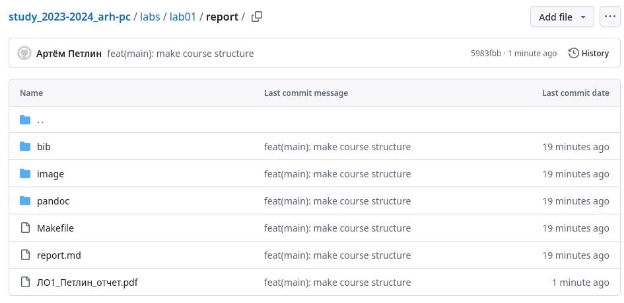

---
## Front matter
title: "Отчёт по лабораторной работе №2"
author: "Петлин Артём Дмитриевич"

## Generic otions
lang: ru-RU
toc-title: "Содержание"

## Bibliography
bibliography: bib/cite.bib
csl: pandoc/csl/gost-r-7-0-5-2008-numeric.csl

## Pdf output format
toc: true # Table of contents
toc-depth: 2
lof: true # List of figures
lot: true # List of tables
fontsize: 12pt
linestretch: 1.5
papersize: a4
documentclass: scrreprt
## I18n polyglossia
polyglossia-lang:
  name: russian
  options:
	- spelling=modern
	- babelshorthands=true
polyglossia-otherlangs:
  name: english
## I18n babel
babel-lang: russian
babel-otherlangs: english
## Fonts
mainfont: IBM Plex Serif
romanfont: IBM Plex Serif
sansfont: IBM Plex Sans
monofont: IBM Plex Mono
mathfont: STIX Two Math
mainfontoptions: Ligatures=Common,Ligatures=TeX,Scale=0.94
romanfontoptions: Ligatures=Common,Ligatures=TeX,Scale=0.94
sansfontoptions: Ligatures=Common,Ligatures=TeX,Scale=MatchLowercase,Scale=0.94
monofontoptions: Scale=MatchLowercase,Scale=0.94,FakeStretch=0.9
mathfontoptions:
## Biblatex
biblatex: true
biblio-style: "gost-numeric"
biblatexoptions:
  - parentracker=true
  - backend=biber
  - hyperref=auto
  - language=auto
  - autolang=other*
  - citestyle=gost-numeric
## Pandoc-crossref LaTeX customization
figureTitle: "Рис."
tableTitle: "Таблица"
listingTitle: "Листинг"
lofTitle: "Список иллюстраций"
lotTitle: "Список таблиц"
lolTitle: "Листинги"
## Misc options
indent: true
header-includes:
  - \usepackage{indentfirst}
  - \usepackage{float} # keep figures where there are in the text
  - \floatplacement{figure}{H} # keep figures where there are in the text
---

# Цель работы

Целью работы является изучить идеологию и применение средств
контроля версий. Приобрести практические навыки по работе с системой git.

# **Выполнение работы**

{#fig:001 width=100%}  

Сначала сделаем предварительную конфигурацию git. Открываем терминал и вводим следующие команды, указав имя и email владельца репозитория.  
{#fig:001 width=100%}  

Настраиваем utf-8 в выводе сообщений git.  

{#fig:001 width=100%}  

Задаем имя начальной ветки (будем называть её master).  
{#fig:001 width=100%}  
Параметр autocrlf.  

{#fig:001 width=100%}  

Параметр safecrlf  

{#fig:001 width=100%}  

Для последующей идентификации пользователя на сервере репозиториев необходимо сгенерировать пару ключей (приватный и открытый).  

{#fig:001 width=100%}  

{#fig:001 width=100%}  

Скопировав из локальной консоли ключ в буфер обмена, вставляем ключ в появившееся на сайте поле и указываем для ключа имя (Title).  

{#fig:001 width=100%}  

Создаём каталог для предмета «Архитектура компьютера».  

{#fig:001 width=100%}  

Создаем репозиторий по шаблону.  

{#fig:001 width=100%}  

В терминале переходим в каталог курса.  

{#fig:001 width=100%}  

клонируем созданный репозиторий.  

{#fig:001 width=100%}  

Переходим в каталог курса и удаляем лишние файлы.  

{#fig:001 width=100%}  

Создаем необходимые каталоги.  

{#fig:001 width=100%}  

{#fig:001 width=100%}  

{#fig:001 width=100%}  

{#fig:001 width=100%}  

{#fig:001 width=100%}  

Отправляем файлы на сервер.  

# **Задание для самостоятельной работы**

**1.**

{#fig:001 width=100%}  

Создаем отчет по выполнению лабораторной работы в соответствующем каталоге рабочего пространства (labs>lab02>report).  

**2.**

{#fig:001 width=100%}  

Копируем отчеты по выполнению предыдущих лабораторных работ в соответствующие каталоги созданного рабочего пространства.  

{#fig:001 width=100%}  

{#fig:001 width=100%}  

Загружаем файлы на github.  

**Вывод:**

Мы изучили идеологию и применение средств контроля версий. Мы приобрели практические навыки по работе с системой git.
