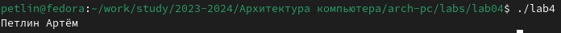

---
## Front matter
title: "Отчёт по лабораторной работе №4"
author: "Петлин Артём Дмитриевич"

## Generic otions
lang: ru-RU
toc-title: "Содержание"

## Bibliography
bibliography: bib/cite.bib
csl: pandoc/csl/gost-r-7-0-5-2008-numeric.csl

## Pdf output format
toc: true # Table of contents
toc-depth: 2
lof: true # List of figures
lot: true # List of tables
fontsize: 12pt
linestretch: 1.5
papersize: a4
documentclass: scrreprt
## I18n polyglossia
polyglossia-lang:
  name: russian
  options:
	- spelling=modern
	- babelshorthands=true
polyglossia-otherlangs:
  name: english
## I18n babel
babel-lang: russian
babel-otherlangs: english
## Fonts
mainfont: IBM Plex Serif
romanfont: IBM Plex Serif
sansfont: IBM Plex Sans
monofont: IBM Plex Mono
mathfont: STIX Two Math
mainfontoptions: Ligatures=Common,Ligatures=TeX,Scale=0.94
romanfontoptions: Ligatures=Common,Ligatures=TeX,Scale=0.94
sansfontoptions: Ligatures=Common,Ligatures=TeX,Scale=MatchLowercase,Scale=0.94
monofontoptions: Scale=MatchLowercase,Scale=0.94,FakeStretch=0.9
mathfontoptions:
## Biblatex
biblatex: true
biblio-style: "gost-numeric"
biblatexoptions:
  - parentracker=true
  - backend=biber
  - hyperref=auto
  - language=auto
  - autolang=other*
  - citestyle=gost-numeric
## Pandoc-crossref LaTeX customization
figureTitle: "Рис."
tableTitle: "Таблица"
listingTitle: "Листинг"
lofTitle: "Список иллюстраций"
lotTitle: "Список таблиц"
lolTitle: "Листинги"
## Misc options
indent: true
header-includes:
  - \usepackage{indentfirst}
  - \usepackage{float} # keep figures where there are in the text
  - \floatplacement{figure}{H} # keep figures where there are in the text
---

# Цель работы

Освоение процедуры компиляции и сборки программ, написанных на ассемблере NASM.

# Задание

1. В каталоге ~/work/arch-pc/lab04 с помощью команды cp создайте копию файла
hello.asm с именем lab4.asm  
2. С помощью любого текстового редактора внесите изменения в текст программы в
файле lab4.asm так, чтобы вместо Hello world! на экран выводилась строка с вашими
фамилией и именем.  
3. Оттранслируйте полученный текст программы lab4.asm в объектный файл. Выполните
компоновку объектного файла и запустите получившийся исполняемый файл.  
4. Скопируйте файлы hello.asm и lab4.asm в Ваш локальный репозиторий в каталог ~/work/study/2023-2024/"Архитектура компьютера"/arch-pc/labs/lab04/.
Загрузите файлы на Github.  

# Теоретическое введение

Язык ассемблера (assembly language, сокращённо asm) — машинно-ориентированный язык низкого уровня. Можно считать, что он больше любых других языков приближен к архитектуре ЭВМ и её аппаратным возможностям, что позволяет получить к ним более полный доступ, нежели в языках высокого уровня,таких как C/C++, Perl, Python и пр. Заметим,
что получить полный доступ к ресурсам компьютера в современных архитектурах нельзя, самым низким уровнем работы прикладной программы является обращение напрямую к ядру операционной системы. Именно на этом уровне и работают программы, написанные на ассемблере. Но в отличие от языков высокого уровня ассемблерная программа содержит
только тот код, который ввёл программист. Таким образом язык ассемблера — это язык, с помощью которого понятным для человека образом пишутся команды для процессора.  
Следует отметить, что процессор понимает не команды ассемблера, а последовательности из нулей и единиц — машинные коды. До появления языков ассемблера программистам
приходилось писать программы, используя только лишь машинные коды, которые были крайне сложны для запоминания, так как представляли собой числа, записанные в двоичной или шестнадцатеричной системе счисления. Преобразование или трансляция команд с языка ассемблера в исполняемый машинный код осуществляется специальной программой
транслятором — Ассемблер.  
Программы, написанные на языке ассемблера, не уступают в качестве и скорости программам, написанным на машинном языке,так как транслятор просто переводит мнемонические
обозначения команд в последовательности бит (нулей и единиц).  
Используемые мнемоники обычно одинаковы для всех процессоров одной архитектуры
или семейства архитектур (среди широко известных — мнемоники процессоров и контроллеров x86, ARM, SPARC, PowerPC,M68k). Таким образом для каждой архитектуры существует
свой ассемблер и, соответственно, свой язык ассемблера.  
Наиболее распространёнными ассемблерами для архитектуры x86 являются:  
- для DOS/Windows: Borland Turbo Assembler (TASM), Microsoft Macro Assembler (MASM) и Watcom assembler (WASM);
- для GNU/Linux: gas (GNU Assembler), использующий AT&T-синтаксис, в отличие от большинства других популярных ассемблеров, которые используют Intel-синтаксис.  
Более подробно о языке ассемблера см., например, в [10].  
В нашем курсе будет использоваться ассемблер NASM (Netwide Assembler) [7; 12; 14].  
NASM — это открытый проект ассемблера, версии которого доступны под различные
операционные системы и который позволяет получать объектные файлы для этих систем. В
NASM используется Intel-синтаксис и поддерживаются инструкции x86-64.  
Типичный формат записи команд NASM имеет вид:  
[метка:] мнемокод [операнд {, операнд}] [; комментарий]  
Здесь мнемокод— непосредственно мнемоника инструкции процессору, которая является
обязательной частью команды. Операндами могут быть числа,данные, адреса регистров или
адреса оперативной памяти. Метка — это идентификатор, с которым ассемблер ассоциирует
некоторое число, чаще всего адрес в памяти. Т.о. метка перед командой связана с адресом
данной команды.  
Допустимыми символами в метках являются буквы, цифры, а также следующие символы:  
_, $, #, @,~,. и ?.  
Начинаться метка или идентификатор могут с буквы, ., _ и ?. Перед идентификаторами,
которые пишутся как зарезервированные слова, нужно писать $, чтобы компилятор трактовал его верно (так называемое экранирование). Максимальная длина идентификатора 4095 символов.  
Программа на языке ассемблера также может содержать директивы — инструкции, не переводящиеся непосредственно в машинные команды, а управляющие работой транслятора. Например, директивы используются для определения данных (констант и переменных) и обычно пишутся большими буквами.

# Выполнение лабораторной работы

{#fig:001 width=100%}  

Переходим в нужный каталог  

{#fig:001 width=100%}  

Создаём текстовый файл с именем hello.asm  

{#fig:001 width=100%}  
{#fig:001 width=100%}  

Открываем этот файл с помощью gedit и введите в него текст, представленный в задании.  

{#fig:001 width=100%}  

преобразовываем текст программы из файла hello.asm в объектный код, который записался в файл hello.o. С помощью команды ls проверяем преобразование.  

{#fig:001 width=100%}  

Выполните следующую команду, которая скомпилирует исходный файл hello.asm в obj.o (опция -o позволяет
задать имя объектного файла, в данном случае obj.o), при этом формат выходного файла
будет elf, и в него будут включены символы для отладки (опция -g), кроме того, был создан
файл листинга list.lst (опция -l).  
С помощью команды ls проверяем, что файлы были созданы.  

{#fig:001 width=100%}  

Передаём объектный файл необходимо на обработку компоновщику. С помощью команды ls проверяем, что исполняемый файл hello был создан.  

{#fig:001 width=100%}  

Выполняем следующую команду. Получаем исполняемый файл "main". Объектный файл, из которого
собран этот исполняемый файл, имеет имя "obj.o".

{#fig:001 width=100%}  

Запускаем на выполнение созданный исполняемый файл, находящийся в текущем каталоге с помощью команды "./hello" .  

# Задание для самостоятельной работы

{#fig:001 width=100%}  

с помощью команды cp создаём копию файла hello.asm с именем lab4.asm

{#fig:001 width=100%}  

С помощью gedit внесим изменения в текст программы в файле lab4.asm так, чтобы вместо Hello world! на экран выводилась строка с моими фамилией и именем.

{#fig:001 width=100%}  

{#fig:001 width=100%}  

{#fig:001 width=100%}  

Оттранслируем полученный текст программы lab4.asm в объектный файл. Выполняем
компоновку объектного файла и запускаем получившийся исполняемый файл.  

{#fig:001 width=100%}  

{#fig:001 width=100%}  

Отправляем файлы на Github.  

# Выводы

Мы освоили процедуры компиляции и сборки программ, написанных на ассемблере NASM.

# Список литературы{.unnumbered}

::: {#refs}
:::
1. GDB: The GNU Project Debugger. — URL: https://www.gnu.org/software/gdb/.  
2. GNU Bash Manual. — 2016. — URL: https://www.gnu.org/software/bash/manual/.  
3. Midnight Commander Development Center. — 2021. — URL: https://midnight-commander.
org/.  
4. NASM Assembly Language Tutorials. — 2021. — URL: https://asmtutor.com/.  
5. Newham C. Learning the bash Shell: Unix Shell Programming. — O’Reilly Media, 2005. —
354 с. — (In a Nutshell). — ISBN 0596009658. — URL: http://www.amazon.com/Learningbash-Shell-Programming-Nutshell/dp/0596009658.  
6. Robbins A. Bash Pocket Reference. — O’Reilly Media, 2016. — 156 с. — ISBN 978-1491941591.  
7. The NASM documentation. — 2021. — URL: https://www.nasm.us/docs.php.  
8. Zarrelli G. Mastering Bash. — Packt Publishing, 2017. — 502 с. — ISBN 9781784396879.  
9. Колдаев В. Д., Лупин С. А. Архитектура ЭВМ. — М. : Форум, 2018.  
10. Куляс О. Л., Никитин К. А. Курс программирования на ASSEMBLER. — М. : Солон-Пресс, 2017.  
11. Новожилов О. П. Архитектура ЭВМ и систем. — М. : Юрайт, 2016.  
12. Расширенный ассемблер: NASM. — 2021. — URL: https://www.opennet.ru/docs/RUS/nasm/.  
13. Робачевский А., Немнюгин С., Стесик О. Операционная система UNIX. — 2-е изд. — БХВПетербург, 2010. — 656 с. — ISBN 978-5-94157-538-1.  
14. Столяров А. Программирование на языке ассемблера NASM для ОС Unix. — 2-е изд. —
М. : МАКС Пресс, 2011. — URL: http://www.stolyarov.info/books/asm_unix.  
15. Таненбаум Э. Архитектура компьютера. — 6-е изд. — СПб. : Питер, 2013. — 874 с. —
(Классика Computer Science).  
16. Таненбаум Э., Бос Х. Современные операционные системы. — 4-е изд. — СПб. : Питер, 2015. — 1120 с. — (Классика Computer Science).  
