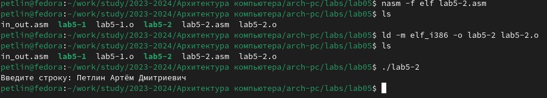

---
## Front matter
title: "Лабораторная работа №5"

author: "Петлин Артём Дмитриевич"

## Generic otions
lang: ru-RU
toc-title: "Содержание"

## Bibliography
bibliography: bib/cite.bib
csl: pandoc/csl/gost-r-7-0-5-2008-numeric.csl

## Pdf output format
toc: true # Table of contents
toc-depth: 2
lof: true # List of figures
lot: true # List of tables
fontsize: 12pt
linestretch: 1.5
papersize: a4
documentclass: scrreprt
## I18n polyglossia
polyglossia-lang:
  name: russian
  options:
	- spelling=modern
	- babelshorthands=true
polyglossia-otherlangs:
  name: english
## I18n babel
babel-lang: russian
babel-otherlangs: english
## Fonts
mainfont: IBM Plex Serif
romanfont: IBM Plex Serif
sansfont: IBM Plex Sans
monofont: IBM Plex Mono
mathfont: STIX Two Math
mainfontoptions: Ligatures=Common,Ligatures=TeX,Scale=0.94
romanfontoptions: Ligatures=Common,Ligatures=TeX,Scale=0.94
sansfontoptions: Ligatures=Common,Ligatures=TeX,Scale=MatchLowercase,Scale=0.94
monofontoptions: Scale=MatchLowercase,Scale=0.94,FakeStretch=0.9
mathfontoptions:
## Biblatex
biblatex: true
biblio-style: "gost-numeric"
biblatexoptions:
  - parentracker=true
  - backend=biber
  - hyperref=auto
  - language=auto
  - autolang=other*
  - citestyle=gost-numeric
## Pandoc-crossref LaTeX customization
figureTitle: "Рис."
tableTitle: "Таблица"
listingTitle: "Листинг"
lofTitle: "Список иллюстраций"
lotTitle: "Список таблиц"
lolTitle: "Листинги"
## Misc options
indent: true
header-includes:
  - \usepackage{indentfirst}
  - \usepackage{float} # keep figures where there are in the text
  - \floatplacement{figure}{H} # keep figures where there are in the text
---

# Цель работы

Приобретение практических навыков работы в Midnight Commander. Освоение инструкций языка ассемблера mov и int.

# Задание

1. Создайте копию файла lab5-1.asm. Внесите изменения в программу (без использования внешнего файла in_out.asm), так чтобы она работала по следующему алгоритму:
  - вывести приглашение типа “Введите строку:”;
  - ввести строку с клавиатуры;
  - вывести введённую строку на экран.
2. Получите исполняемый файл и проверьте его работу. На приглашение ввести строку введите свою фамилию.
3. Создайте копию файла lab5-2.asm. Исправьте текст программы с использование подпрограмм из внешнего файла in_out.asm, так чтобы она работала по следующему алгоритму:
  - вывести приглашение типа “Введите строку:”;
  - ввести строку с клавиатуры;
  - вывести введённую строку на экран
4. Создайте исполняемый файл и проверьте его работу.

# Теоретическое введение

## Основы работы с Midnight Commander.

Midnight Commander (или просто mc) — это программа, которая позволяет просматривать структуру каталогов и выполнять основные операции по управлению файловой системой, т.е. mc является файловым менеджером. Midnight Commander позволяет сделать работу с файлами более удобной и наглядной. Для активации оболочки Midnight Commander достаточно ввести в командной строке mc и нажать клавишу Enter (рис. 5.1). В Midnight Commander используются функциональные клавиши F1 — F10 , к которым привязаны часто выполняемые операции.

## Структура программы на языке ассемблера NASM

Программа на языке ассемблера NASM, как правило, состоит из трёх секций: секция кода программы (SECTION .text), секция инициированных (известных во время компиляции) данных (SECTION .data) и секция неинициализированных данных (тех, под которые во время компиляции только отводится память, а значение присваивается в ходе выполнения программы) (SECTION .bss).  

Для объявления инициированных данных в секции .data используются директивы DB, DW, DD, DQ и DT, которые резервируют память и указывают, какие значения должны храниться в этой памяти:  
- DB (define byte) — определяет переменную размером в 1 байт;
- DW (define word) — определяет переменную размеров в 2 байта (слово);
- DD (define double word) — определяет переменную размером в 4 байта (двойное слово);
- DQ (define quad word)— определяет переменную размером в 8 байт (учетверённое слово);
- DT (define ten bytes) — определяет переменную размером в 10 байт.  
Директивы используются для объявления простых переменных и для объявления массивов. Для определения строк принято использовать директиву DB в связи с особенностями хранения данных в оперативной памяти.

## Элементы программирования

Инструкция языка ассемблера mov предназначена для дублирования данных источника в приёмнике. В общем виде эта инструкция записывается в виде:  
*mov dst,src*  
Здесь операнд dst — приёмник, а src — источник.  
В качестве операнда могут выступать регистры (register), ячейки памяти (memory) и непосредственные значения (const).  
ВАЖНО! Переслать значение из одной ячейки памяти в другую нельзя, для этого необходимо использовать две инструкции mov:  
*mov eax, x*  
*mov y, eax*  
Также необходимо учитывать то, что размер операндов приемника и источника должны
совпадать. Использование слудующих примеров приведет к ошибке:  
- *mov al,1000h — ошибка, попытка записать 2-байтное число в 1-байтный регистр;*  
- *mov eax,cx — ошибка, размеры операндов не совпадают.*  

# Выполнение лабораторной работы

{#fig:001 width=100%}

Открываем Midnight Commander.  

{#fig:001 width=100%}

Переходим в каталог ~/work/arch-pc созданный при выполнении лабораторной работы №4.  

{#fig:001 width=100%}  
{#fig:001 width=100%}

С помощью функциональной клавиши F7 создаём папку lab05 и переходим в созданный каталог. Пользуясь строкой ввода и командой touch создаём файл lab5-1.asm  

{#fig:001 width=100%}

С помощью функциональной клавиши F4 открываем файл lab5-1.asm для редактирования во встроенном редакторе и вводим предложенный текст программы, сохраняем изменения и закрываем файл.  

{#fig:001 width=100%}

С помощью функциональной клавиши F3 открываем файл lab5-1.asm для просмотра. Убеждаемся, что файл содержит текст программы.  

{#fig:001 width=100%}

Оттранслируем текст программы lab5-1.asm в объектный файл. Выполняем компоновку объектного файла и запускаем получившийся исполняемый файл. На запрос вводим своё ФИО.

{#fig:001 width=100%}  
{#fig:001 width=100%}

Скачиваем файл in_out.asm и переносим его в тот же каталог, где лежит и файл с программой, в которой он используется. С помощью функциональной клавиши F6 создаём копию файла lab5-1.asm с именем
lab5-2.asm.  

{#fig:001 width=100%}

Исправляем текст программы в файле lab5-2.asm с использование подпрограмм из внешнего файла in_out.asm.  

{#fig:001 width=100%}

Создайте исполняемый файл и проверьте его работу.  

{#fig:001 width=100%}

В файле lab5-2.asm заменяем подпрограмму sprintLF на sprint.  

{#fig:001 width=100%}

Создаём исполняемый файл и проверяем его работу. Замечаем разницу, что sprintLF переводит ввод на следующую строку, в отличии от sprint, где фраза "Введите строку" и ввод с клавиатуры находяться на одной строке.  

# Задание для самостоятельной работы.

{#fig:001 width=100%}

Создаём копию файла lab5-1.asm (lab5-3.asm). Вносим изменения в программу (без использования внешнего файла in_out.asm), так чтобы она работала по следующему алгоритму:  
- вывести приглашение типа “Введите строку:”;
- ввести строку с клавиатуры;
- вывести введённую строку на экран.

{#fig:001 width=100%}

Получаем исполняемый файл и проверяем его работу. На приглашение ввести строку
вводим свою фамилию.

{#fig:001 width=100%}

Создайте копию файла lab5-2.asm (lab5-4.asm). Исправляем текст программы с использование подпрограмм из внешнего файла in_out.asm, так чтобы она работала по следующему алгоритму:  
- вывести приглашение типа “Введите строку:”;
- ввести строку с клавиатуры;
- вывести введённую строку на экран.

{#fig:001 width=100%}

Создаём исполняемый файл и проверяем его работу.

# Выводы

Мы приобрели практические навыки работы в Midnight Commander, освоили инструкции
языка ассемблера mov и int.

# Список литературы{.unnumbered}

::: {#refs}
:::
1. GDB: The GNU Project Debugger. — URL: https://www.gnu.org/software/gdb/.  
2. GNU Bash Manual. — 2016. — URL: https://www.gnu.org/software/bash/manual/.  
3. Midnight Commander Development Center. — 2021. — URL: https://midnight-commander.
org/.  
4. NASM Assembly Language Tutorials. — 2021. — URL: https://asmtutor.com/.  
5. Newham C. Learning the bash Shell: Unix Shell Programming. — O’Reilly Media, 2005. —
354 с. — (In a Nutshell). — ISBN 0596009658. — URL: http://www.amazon.com/Learningbash-Shell-Programming-Nutshell/dp/0596009658.  
6. Robbins A. Bash Pocket Reference. — O’Reilly Media, 2016. — 156 с. — ISBN 978-1491941591.  
7. The NASM documentation. — 2021. — URL: https://www.nasm.us/docs.php.  
8. Zarrelli G. Mastering Bash. — Packt Publishing, 2017. — 502 с. — ISBN 9781784396879.  
9. Колдаев В. Д., Лупин С. А. Архитектура ЭВМ. — М. : Форум, 2018.  
10. Куляс О. Л., Никитин К. А. Курс программирования на ASSEMBLER. — М. : Солон-Пресс, 2017.  
11. Новожилов О. П. Архитектура ЭВМ и систем. — М. : Юрайт, 2016.  
12. Расширенный ассемблер: NASM. — 2021. — URL: https://www.opennet.ru/docs/RUS/nasm/.  
13. Робачевский А., Немнюгин С., Стесик О. Операционная система UNIX. — 2-е изд. — БХВПетербург, 2010. — 656 с. — ISBN 978-5-94157-538-1.  
14. Столяров А. Программирование на языке ассемблера NASM для ОС Unix. — 2-е изд. —
М. : МАКС Пресс, 2011. — URL: http://www.stolyarov.info/books/asm_unix.  
15. Таненбаум Э. Архитектура компьютера. — 6-е изд. — СПб. : Питер, 2013. — 874 с. —
(Классика Computer Science).  
16. Таненбаум Э., Бос Х. Современные операционные системы. — 4-е изд. — СПб. : Питер, 2015. — 1120 с. — (Классика Computer Science).  
