---
## Front matter
title: "Отчёт по лабораторной работе №6"

author: "Петлин Артём Дмитриевич"

## Generic otions
lang: ru-RU
toc-title: "Содержание"

## Bibliography
bibliography: bib/cite.bib
csl: pandoc/csl/gost-r-7-0-5-2008-numeric.csl

## Pdf output format
toc: true # Table of contents
toc-depth: 2
lof: true # List of figures
lot: true # List of tables
fontsize: 12pt
linestretch: 1.5
papersize: a4
documentclass: scrreprt
## I18n polyglossia
polyglossia-lang:
  name: russian
  options:
	- spelling=modern
	- babelshorthands=true
polyglossia-otherlangs:
  name: english
## I18n babel
babel-lang: russian
babel-otherlangs: english
## Fonts
mainfont: IBM Plex Serif
romanfont: IBM Plex Serif
sansfont: IBM Plex Sans
monofont: IBM Plex Mono
mathfont: STIX Two Math
mainfontoptions: Ligatures=Common,Ligatures=TeX,Scale=0.94
romanfontoptions: Ligatures=Common,Ligatures=TeX,Scale=0.94
sansfontoptions: Ligatures=Common,Ligatures=TeX,Scale=MatchLowercase,Scale=0.94
monofontoptions: Scale=MatchLowercase,Scale=0.94,FakeStretch=0.9
mathfontoptions:
## Biblatex
biblatex: true
biblio-style: "gost-numeric"
biblatexoptions:
  - parentracker=true
  - backend=biber
  - hyperref=auto
  - language=auto
  - autolang=other*
  - citestyle=gost-numeric
## Pandoc-crossref LaTeX customization
figureTitle: "Рис."
tableTitle: "Таблица"
listingTitle: "Листинг"
lofTitle: "Список иллюстраций"
lotTitle: "Список таблиц"
lolTitle: "Листинги"
## Misc options
indent: true
header-includes:
  - \usepackage{indentfirst}
  - \usepackage{float} # keep figures where there are in the text
  - \floatplacement{figure}{H} # keep figures where there are in the text
---

# Цель работы

Освоение арифметических инструкций языка ассемблера NASM.

# Задание для самостоятельной работы

1. Написать программу вычисления выражения y = f(x). Программа должна выводить
выражение для вычисления, выводить запрос на ввод значения x, вычислять заданное выражение в зависимости от введенного x, выводить результат вычислений. Вид
функции f(x) выбрать из таблицы 6.3 вариантов заданий в соответствии с номером
полученным при выполнении лабораторной работы. Создайте исполняемый файл и
проверьте его работу для значений x1 и x2 из 6.3.

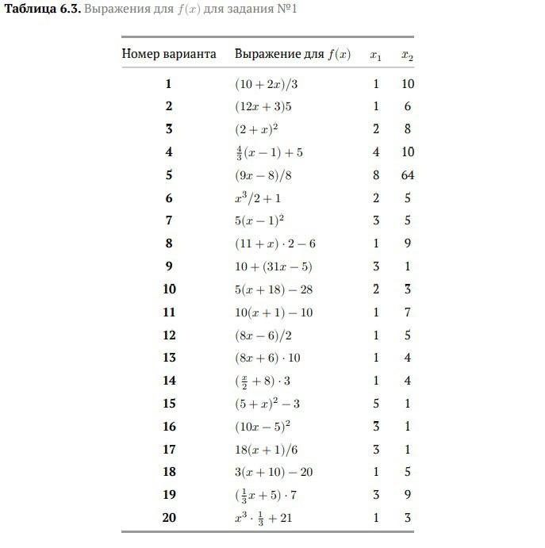{#fig:001 width=100%}  

При выполнении задания преобразовывать (упрощать) выражения для f(x) нельзя. При
выполнении деления в качестве результата можно использовать только целую часть от
деления и не учитывать остаток (т.е. 5 : 2 = 2).

# Теоретическое введение

## Адресация в NASM 

Большинство инструкций на языке ассемблера требуют обработки операндов. Адрес операнда предоставляет место, где хранятся данные, подлежащие обработке. Это могут быть
данные хранящиеся в регистре или в ячейке памяти. Далее рассмотрены все существующие
способы задания адреса хранения операндов – способы адресации.  
Существует три основных способа адресации:  

  - Регистровая адресация – операнды хранятся в регистрах и в команде используются имена этих регистров, например: mov ax,bx.  
  - Непосредственная адресация – значение операнда задается непосредственно в команде, Например: mov ax,2.  
  - Адресация памяти – операнд задает адрес в памяти. В команде указывается символическое обозначение ячейки памяти, над содержимым которой требуется выполнить операцию.  

Например, определим переменную intg DD 3 – это означает, что задается область памяти размером 4 байта, адрес которой обозначен меткой intg. В таком случае, команда  

       mov eax,[intg]  

копирует из памяти по адресу intg данные в регистр eax. В свою очередь команда  

       mov [intg],eax  

запишет в память по адресу intg данные из регистра eax.  
Также рассмотрим команду  

       mov eax,intg  

В этом случае в регистр eax запишется адрес intg. Допустим, для intg выделена память
начиная с ячейки с адресом 0x600144, тогда команда mov eax,intg аналогична команде mov
eax,0x600144 – т.е. эта команда запишет в регистр eax число 0x600144.

## Арифметические операции в NASM

### Целочисленное сложение add.

Схема команды целочисленного сложения add (от англ. addition - добавление) выполняет
сложение двух операндов и записывает результат по адресу первого операнда. Команда add
работает как с числами со знаком, так и без знака и выглядит следующим образом:  

       add <операнд_1>, <операнд_2>  
  
Допустимые сочетания операндов для команды add аналогичны сочетаниям операндов
для команды mov.  
Так, например, команда add eax,ebx прибавит значение из регистра eax к значению из
регистра ebx и запишет результат в регистр eax.  
Примеры:  

       add ax,5 ; AX = AX + 5  
       add dx,cx ; DX = DX + CX  
       add dx,cl ; Ошибка: разный размер операндов.  

### Целочисленное вычитание sub.

Команда целочисленного вычитания sub (от англ. subtraction – вычитание) работает аналогично команде add и выглядит следующим образом:  
       sub <операнд_1>, <операнд_2>  
Так, например, команда sub ebx,5 уменьшает значение регистра ebx на 5 и записывает
результат в регистр ebx.

### Команды инкремента и декремента.

Довольно часто при написании программ встречается операция прибавления или вычитания единицы. Прибавление единицы называется инкрементом, а вычитание — декрементом.
Для этих операций существуют специальные команды: inc (от англ. increment) и dec (от англ.
decrement), которые увеличивают и уменьшают на 1 свой операнд.  
    Эти команды содержат один операнд и имеет следующий вид:  

       inc <операнд>  
       
       dec <операнд>  

Операндом может быть регистр или ячейка памяти любого размера. Команды инкремента
и декремента выгодны тем, что они занимают меньше места, чем соответствующие команды
сложения и вычитания.  
Так, например, команда inc ebx увеличивает значение регистра ebx на 1, а команда inc
ax уменьшает значение регистра ax на 1.

### Команда изменения знака операнда neg.

Еще одна команда, которую можно отнести к арифметическим командам это команда
изменения знака neg:  

       neg <операнд>  
       
Команда neg рассматривает свой операнд как число со знаком и меняет знак операнда на
противоположный. Операндом может быть регистр или ячейка памяти любого размера.  

       mov ax,1 ; AX = 1  
       neg ax ; AX = -1  

### Команды умножения mul и imul.

Умножение и деление, в отличии от сложения и вычитания, для знаковых и беззнаковых
чисел производиться по-разному, поэтому существуют различные команды.
Для беззнакового умножения используется команда mul (от англ. multiply – умножение):  

       mul <операнд>  

Для знакового умножения используется команда imul:

       imul <операнд>  

Для команд умножения один из сомножителей указывается в команде и должен находиться в регистре или в памяти, но не может быть непосредственным операндом. Второй
сомножитель в команде явно не указывается и должен находиться в регистре EAX,AX или
AL, а результат помещается в регистры EDX:EAX, DX:AX или AX, в зависимости от размера
операнда 6.1.

### Команды деления div и idiv.

Для деления, как и для умножения, существует 2 команды div (от англ. divide - деление) и
idiv:  

       div <делитель> ; Беззнаковое деление  
       idiv <делитель> ; Знаковое деление  

В командах указывается только один операнд – делитель, который может быть регистром
или ячейкой памяти, но не может быть непосредственным операндом. Местоположение
делимого и результата для команд деления зависит от размера делителя. Кроме того, так как
в результате деления получается два числа – частное и остаток, то эти числа помещаются в
определённые регистры 6.2.  
Например, после выполнения инструкций  

       mov ax,31  
       mov dl,15  
       div dl  
       
результат 2 (31/15) будет записан в регистр al, а остаток 1 (остаток от деления 31/15) — в
регистр ah.  
Если делитель — это слово (16-бит), то делимое должно записываться в регистрах dx:ax.
Так в результате выполнения инструкций  

       mov ax,2 ; загрузить в регистровую  
       mov dx,1 ; пару `dx:ax` значение 10002h  
       mov bx,10h  
       div bx  

в регистр ax запишется частное 1000h (результат деления 10002h на 10h), а в регистр dx —
2 (остаток от деления).

## Перевод символа числа в десятичную символьную запись

Ввод информации с клавиатуры и вывод её на экран осуществляется в символьном виде.
Кодирование этой информации производится согласно кодовой таблице символов ASCII.
ASCII – сокращение от American Standard Code for Information Interchange (Американский
стандартный код для обмена информацией). Согласно стандарту ASCII каждый символ
кодируется одним байтом.
Расширенная таблица ASCII состоит из двух частей. Первая (символы с кодами 0-127)
является универсальной (см. Приложение.), а вторая (коды 128-255) предназначена для
специальных символов и букв национальных алфавитов и на компьютерах разных типов
может меняться.
Среди инструкций NASM нет такой, которая выводит числа (не в символьном виде). Поэтому, например, чтобы вывести число, надо предварительно преобразовать его цифры в
ASCII-коды этих цифр и выводить на экран эти коды, а не само число. Если же выводить число
на экран непосредственно, то экран воспримет его не как число, а как последовательность
ASCII-символов – каждый байт числа будет воспринят как один ASCII-символ – и выведет на
экран эти символы.
Аналогичная ситуация происходит и при вводе данных с клавиатуры. Введенные данные будут представлять собой символы, что сделает невозможным получение корректного
результата при выполнении над ними арифметических операций.
Для решения этой проблемы необходимо проводить преобразование ASCII символов в
числа и обратно.
Для выполнения лабораторных работ в файле in_out.asm реализованы подпрограммы
для преобразования ASCII символов в числа и обратно. Это:

  - iprint – вывод на экран чисел в формате ASCII, перед вызовом iprint в регистр eax
необходимо записать выводимое число (mov eax,<int>).
  - iprintLF – работает аналогично iprint, но при выводе на экран после числа добавляет
к символ перевода строки.
  - atoi – функция преобразует ascii-код символа в целое число и записает результат
в регистр eax, перед вызовом atoi в регистр eax необходимо записать число (mov
eax,<int>).

# Выполнение лабораторной работы

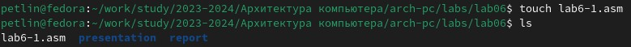{#fig:001 width=100%}  

Создаём файл lab6-1.asm.

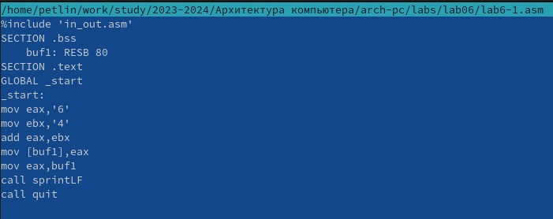{#fig:001 width=100%}  
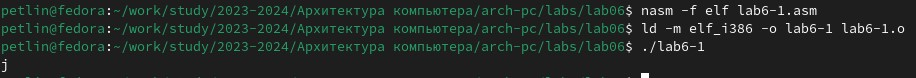{#fig:001 width=100%}  

Вводим в файл lab6-1.asm текст программы из листинга 6.1 и создаём исполняемый файл и запускаем его. Не получаем число 10.

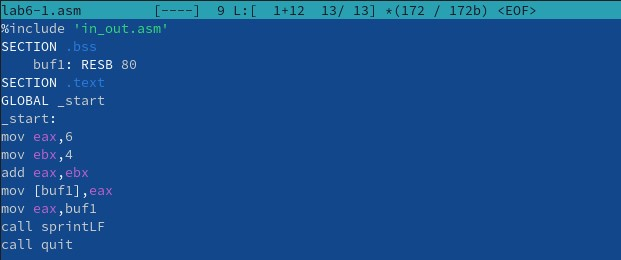{#fig:001 width=100%}  
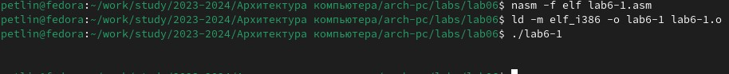{#fig:001 width=100%}  
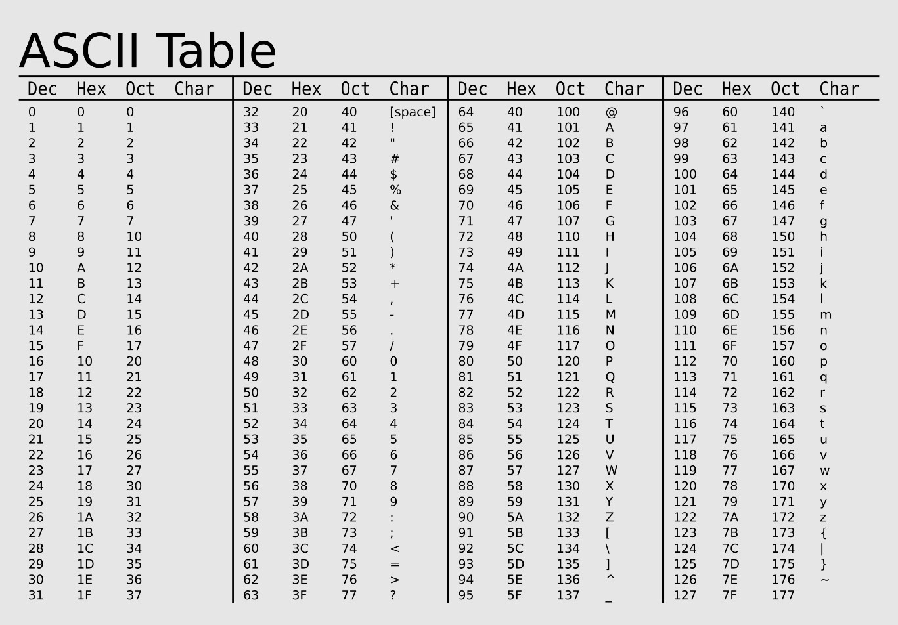{#fig:001 width=100%}  

Далее изменяем текст программы и вместо символов, записывам в регистры числа. Создаём исполняемый файл и запускаем его. Снова не получаем число 10. Вывод содержит пустые символы (пробелы).

{#fig:001 width=100%}  
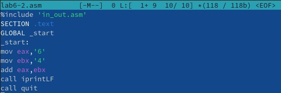{#fig:001 width=100%}  
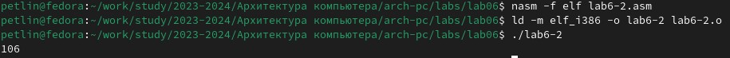{#fig:001 width=100%}  

Создаём файл lab6-2.asm, вводим в него текст программы из листинга 6.2 и создаём исполняемый файл и запускаем его. В результате работы программы мы получаем число 106.

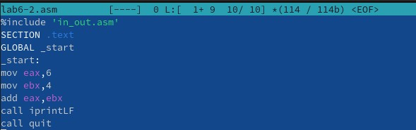{#fig:001 width=100%}  
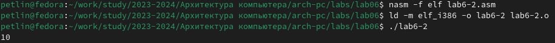{#fig:001 width=100%}  

Аналогично предыдущему примеру изменим символы на числа. Создаём исполняемый файл и запускаем его. В результате работы программы мы получаем число 10.

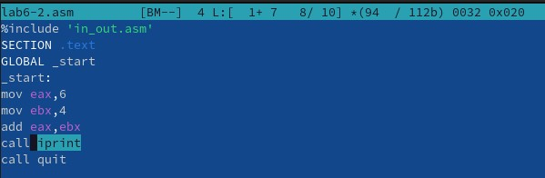{#fig:001 width=100%}  
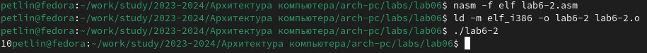{#fig:001 width=100%}  

Заменяем функцию iprintLF на iprint. Создаём исполняемый файл и запускаем его. В результате работы программы мы получаем число 10, однако в этот раз в конце программа не переходит на новую строку.

{#fig:001 width=100%}  
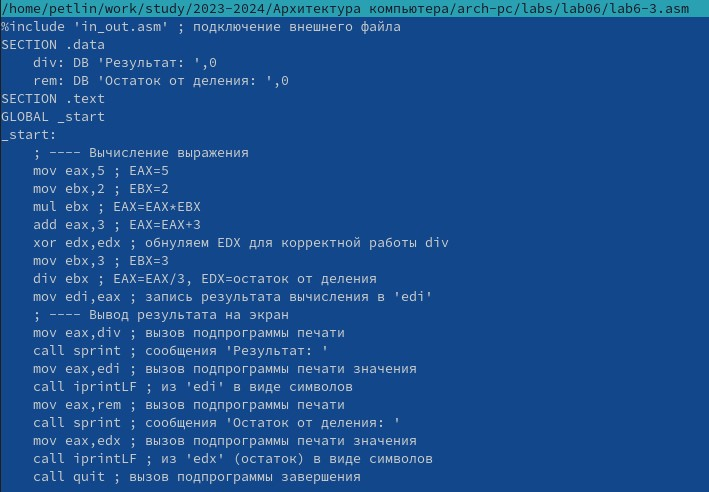{#fig:001 width=100%}  
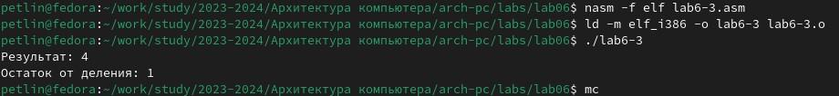{#fig:001 width=100%}  

В качестве примера выполнения арифметических операций в NASM приведем программу вычисления арифметического выражения 𝑓(𝑥) = (5 ∗ 2 + 3)/3.  
Создаём файл lab6-3.asm, вводим в него текст программы из листинга 6.3, создаём исполняемый файл и запускаем его. Результат работы программы:  

       Результат: 4  
       Остаток от деления: 1  

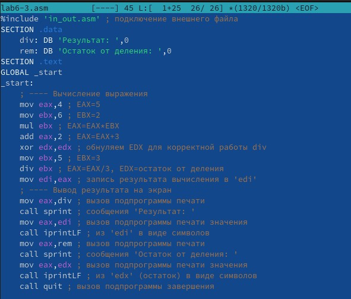{#fig:001 width=100%}  
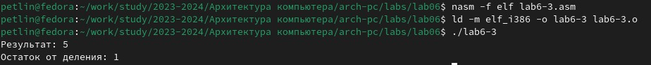{#fig:001 width=100%}  

Изменяем текст программы для вычисления выражения 𝑓(𝑥) = (4 ∗ 6 + 2)/5. Создаём
исполняемый файл и проверяем его работу. Вывод верен.  

|  

    В качестве другого примера рассмотрим программу вычисления варианта задания по
номеру студенческого билета, работающую по следующему алгоритму:  

  - вывести запрос на введение № студенческого билета
  - вычислить номер варианта по формуле: (𝑆𝑛 mod 20) + 1, где 𝑆𝑛 – номер студенческого билета (В данном случае 𝑎 mod 𝑏 – это остаток от деления 𝑎 на 𝑏).
  - вывести на экран номер варианта.

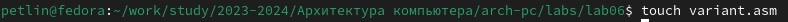{#fig:001 width=100%}  
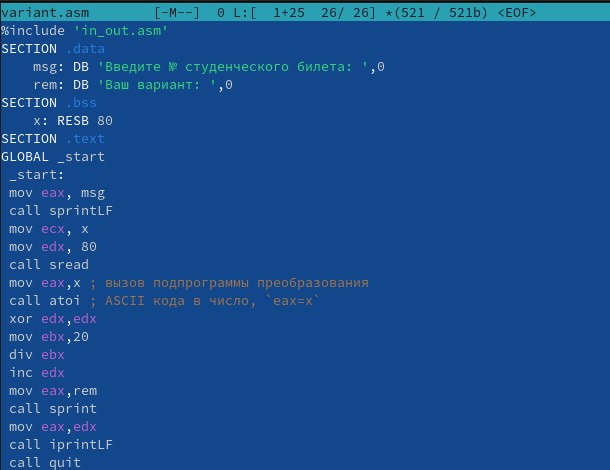{#fig:001 width=100%}  
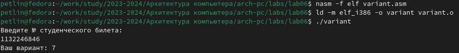{#fig:001 width=100%}  

Создаём файл variant.asm, вводим в него текст программы из листинга 6.4, создаём исполняемый файл и запускаем его. Результат работы программы: 7. Однако, проверив результат работы программы,
вычислив номер варианта аналитически, получаем 6. Изменим программу, чтобы результат был верен, для этого убираем строку inc edx, так как она добавляет 1 к нашему ответу:

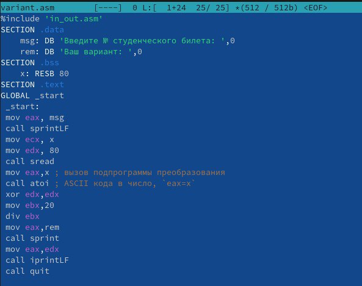{#fig:001 width=100%}  
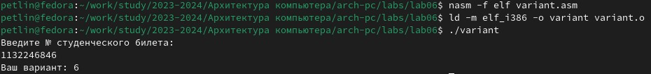{#fig:001 width=100%}  

Теперь программа работает правильно.

# Ответы на вопросы

1. Какие строки листинга 6.4 отвечают за вывод на экран сообщения ‘Ваш вариант:’?  
Ответ:  
       mov eax,rem  
       call sprint  
2. Для чего используется следующие инструкции?  
       mov ecx, x  
       mov edx, 80  
       call sread  
Ответ: данные инструкции используются для чтения строки с введенными пользователем данными. Начальный адрес строки сохраняется в ecx, максимальное количетво символов которое может быть считано сохраняется в edx, а call sread производит чтение строки.
3. Для чего используется инструкция “call atoi”?  
Ответ: инструкция преобразовывает ASCII код в число
4. Какие строки листинга 6.4 отвечают за вычисления варианта?  
Ответ:  
       mov eax,x ; вызов подпрограммы преобразования  
       call atoi ; ASCII кода в число, `eax=x`  
       xor edx,edx ; обнуление edx  
       mov ebx,20 ; ebx=20  
       div ebx ; eax mod ebx = номер варианта  

Eax сохраняет в себе номер стунденческого билета, ebx сохраняет себе делитель 20. Программа делит eax на ebx и остаток записывается в edx, поэтому он предварительно был обнулен (для корректной работы div).
5. В какой регистр записывается остаток от деления при выполнении инструкции “div
ebx”?  
Ответ: в регистр edx
6. Для чего используется инструкция “inc edx”?  
Ответ: увеличивает значение в регистре edx на 1
7. Какие строки листинга 6.4 отвечают за вывод на экран результата вычислений?  
Ответ:  
       mov eax,edx  
       call iprintLF  
Происходит запись в регистр eax полученного значение остатка от деления, и с помощью инструкции call iprintLF производиться вывод на экран. (Необходимо записать остаток из регистра edx в регистр eax, так как инструкция выводит на экран значение из регистра eax).  

# Выполнение задания для самостоятельной работы

Напишем программу вычисления выражения предложенного в варианте, получившемся при выполнении лабораторной работы (6) 𝑥^3/2 + 1:

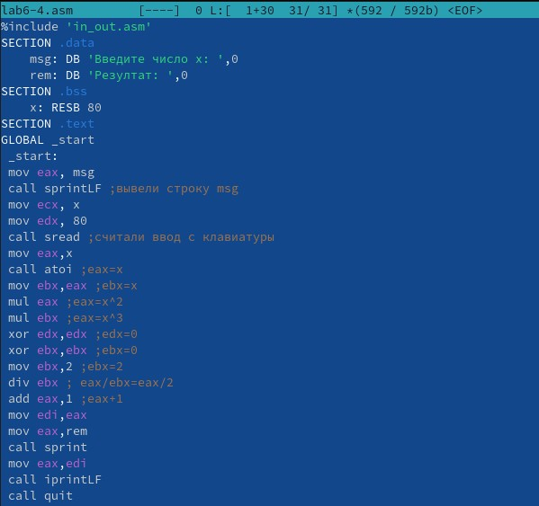{#fig:001 width=100%}  
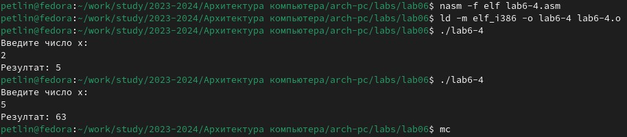{#fig:001 width=100%}  

Написав следующий код и создав исполняемый файл, проверяем его работу для предложенных x1=2, x2=5. Проверив результат работы программы аналитически, убеждаемся, что программа работает верно.

# Выводы

Мы освоили арифметических инструкций языка ассемблера NASM.

# Список литературы{.unnumbered}

::: {#refs}
:::
1. GDB: The GNU Project Debugger. — URL: https://www.gnu.org/software/gdb/.  
2. GNU Bash Manual. — 2016. — URL: https://www.gnu.org/software/bash/manual/.  
3. Midnight Commander Development Center. — 2021. — URL: https://midnight-commander.
org/.  
4. NASM Assembly Language Tutorials. — 2021. — URL: https://asmtutor.com/.  
5. Newham C. Learning the bash Shell: Unix Shell Programming. — O’Reilly Media, 2005. —
354 с. — (In a Nutshell). — ISBN 0596009658. — URL: http://www.amazon.com/Learningbash-Shell-Programming-Nutshell/dp/0596009658.  
6. Robbins A. Bash Pocket Reference. — O’Reilly Media, 2016. — 156 с. — ISBN 978-1491941591.  
7. The NASM documentation. — 2021. — URL: https://www.nasm.us/docs.php.  
8. Zarrelli G. Mastering Bash. — Packt Publishing, 2017. — 502 с. — ISBN 9781784396879.  
9. Колдаев В. Д., Лупин С. А. Архитектура ЭВМ. — М. : Форум, 2018.  
10. Куляс О. Л., Никитин К. А. Курс программирования на ASSEMBLER. — М. : Солон-Пресс, 2017.  
11. Новожилов О. П. Архитектура ЭВМ и систем. — М. : Юрайт, 2016.  
12. Расширенный ассемблер: NASM. — 2021. — URL: https://www.opennet.ru/docs/RUS/nasm/.  
13. Робачевский А., Немнюгин С., Стесик О. Операционная система UNIX. — 2-е изд. — БХВПетербург, 2010. — 656 с. — ISBN 978-5-94157-538-1.  
14. Столяров А. Программирование на языке ассемблера NASM для ОС Unix. — 2-е изд. —
М. : МАКС Пресс, 2011. — URL: http://www.stolyarov.info/books/asm_unix.  
15. Таненбаум Э. Архитектура компьютера. — 6-е изд. — СПб. : Питер, 2013. — 874 с. —
(Классика Computer Science).  
16. Таненбаум Э., Бос Х. Современные операционные системы. — 4-е изд. — СПб. : Питер, 2015. — 1120 с. — (Классика Computer Science).  
