---
## Front matter
title: "Отчёт по лабораторной работе №7"

author: "Петлин Артём Дмитриевич"

## Generic otions
lang: ru-RU
toc-title: "Содержание"

## Bibliography
bibliography: bib/cite.bib
csl: pandoc/csl/gost-r-7-0-5-2008-numeric.csl

## Pdf output format
toc: true # Table of contents
toc-depth: 2
lof: true # List of figures
lot: true # List of tables
fontsize: 12pt
linestretch: 1.5
papersize: a4
documentclass: scrreprt
## I18n polyglossia
polyglossia-lang:
  name: russian
  options:
	- spelling=modern
	- babelshorthands=true
polyglossia-otherlangs:
  name: english
## I18n babel
babel-lang: russian
babel-otherlangs: english
## Fonts
mainfont: IBM Plex Serif
romanfont: IBM Plex Serif
sansfont: IBM Plex Sans
monofont: IBM Plex Mono
mathfont: STIX Two Math
mainfontoptions: Ligatures=Common,Ligatures=TeX,Scale=0.94
romanfontoptions: Ligatures=Common,Ligatures=TeX,Scale=0.94
sansfontoptions: Ligatures=Common,Ligatures=TeX,Scale=MatchLowercase,Scale=0.94
monofontoptions: Scale=MatchLowercase,Scale=0.94,FakeStretch=0.9
mathfontoptions:
## Biblatex
biblatex: true
biblio-style: "gost-numeric"
biblatexoptions:
  - parentracker=true
  - backend=biber
  - hyperref=auto
  - language=auto
  - autolang=other*
  - citestyle=gost-numeric
## Pandoc-crossref LaTeX customization
figureTitle: "Рис."
tableTitle: "Таблица"
listingTitle: "Листинг"
lofTitle: "Список иллюстраций"
lotTitle: "Список таблиц"
lolTitle: "Листинги"
## Misc options
indent: true
header-includes:
  - \usepackage{indentfirst}
  - \usepackage{float} # keep figures where there are in the text
  - \floatplacement{figure}{H} # keep figures where there are in the text
---

# Цель работы

Изучение команд условного и безусловного переходов. Приобретение навыков написания
программ с использованием переходов. Знакомство с назначением и структурой файла
листинга.

# Задание

1. Напишите программу нахождения наименьшей из 3 целочисленных переменных 𝑎,𝑏 и .
Значения переменных выбрать из табл. 7.5 в соответствии с вариантом, полученным
при выполнении лабораторной работы № 7. Создайте исполняемый файл и проверьте
его работу.
2. Напишите программу, которая для введенных с клавиатуры значений 𝑥 и 𝑎 вычисляет
значение заданной функции 𝑓(𝑥) и выводит результат вычислений. Вид функции 𝑓(𝑥)
выбрать из таблицы 7.6 вариантов заданий в соответствии с вариантом, полученным
при выполнении лабораторной работы № 7. Создайте исполняемый файл и проверьте
его работу для значений 𝑥 и 𝑎 из 7.6.

# Теоретическое введение

Для реализации ветвлений в ассемблере используются так называемые команды передачи
управления или команды перехода. Можно выделить 2 типа переходов:  

   - условный переход – выполнение или не выполнение перехода в определенную точку
программы в зависимости от проверки условия.  

   - безусловный переход – выполнение передачи управления в определенную точку программы без каких-либо условий.  

## Команды безусловного перехода

Безусловный переход выполняется инструкцией jmp (от англ. jump – прыжок), которая
включает в себя адрес перехода, куда следует передать управление:  
       jmp <адрес_перехода>
Адрес перехода может быть либо меткой, либо адресом области памяти, в которую предварительно помещен указатель перехода. Кроме того, в качестве операнда можно использовать
имя регистра, в таком случае переход будет осуществляться по адресу, хранящемуся в этом
регистре.  

В следующем примере рассмотрим использование инструкции jmp:  

label:  

       ... ;  
       ... ; команды  
       ... ;  
       jmp label  

## Команды условного перехода

Как отмечалось выше, для условного перехода необходима проверка какого-либо условия.
В ассемблере команды условного перехода вычисляют условие перехода анализируя флаги
из регистра флагов.

### Регистр флагов

Флаг – это бит, принимающий значение 1 («флаг установлен»), если выполнено некоторое
условие, и значение 0 («флаг сброшен») в противном случае. Флаги работают независимо
друг от друга, и лишь для удобства они помещены в единый регистр — регистр флагов, отражающий текущее состояние процессора. В следующей таблице указано положение битовых
флагов в регистре флагов.  

Флаги состояния (биты 0, 2, 4, 6, 7 и 11) отражают результат выполнения арифметических
инструкций, таких как ADD, SUB, MUL, DIV  

### Описание инструкции cmp

Инструкция cmp является одной из инструкций, которая позволяет сравнить операнды и
выставляет флаги в зависимости от результата сравнения.  
Инструкция cmp является командой сравнения двух операндов и имеет такой же формат,
как и команда вычитания:  

       cmp <операнд_1>, <операнд_2>  
       
Команда cmp, так же как и команда вычитания, выполняет вычитание <операнд_2> -
<операнд_1>, но результат вычитания никуда не записывается и единственным результатом
команды сравнения является формирование флагов.

### Описание команд условного перехода.

Команда условного перехода имеет вид  

       j<мнемоника перехода> label
       
Мнемоника перехода связана со значением анализируемых флагов или со способом формирования этих флагов.  
В табл. 7.3. представлены команды условного перехода, которые обычно ставятся после
команды сравнения cmp. В их мнемокодах указывается тот результат сравнения, при котором
надо делать переход. Мнемоники, идентичные по своему действию, написаны в таблице
через дробь (например, ja и jnbe). Программист выбирает, какую из них применить, чтобы
получить более простой для понимания текст программы.  
В качестве примера рассмотрим фрагмент программы, которая выполняет умножение
переменных 𝑎 и 𝑏 и если произведение превосходит размер байта, передает управление на
метку Error.  

       mov al, a  
       mov bl, b  
       mul bl  
       jc Error  

## Файл листинга и его структура

Листинг (в рамках понятийного аппарата NASM) — это один из выходных файлов, создаваемых транслятором. Он имеет текстовый вид и нужен при отладке программы, так как
кроме строк самой программы он содержит дополнительную информацию.  
Ниже приведён фрагмент файла листинга.  

       10 00000000 B804000000 mov eax,4  
       11 00000005 BB01000000 mov ebx,1  
       12 0000000A B9[00000000] mov ecx,hello  
       13 0000000F BA0D000000 mov edx,helloLen  
       14  
       15 00000014 CD80 int 80h  

Все ошибки и предупреждения, обнаруженные при ассемблировании, транслятор выводит
на экран, и файл листинга не создаётся.  
Итак, структура листинга:  

   - номер строки — это номер строки файла листинга (нужно помнить, что номер строки в
файле листинга может не соответствовать номеру строки в файле с исходным текстом
программы);  

   - адрес — это смещение машинного кода от начала текущего сегмента;  

   - машинный код представляет собой ассемблированную исходную строку в виде шестнадцатеричной последовательности. (например, инструкция int 80h начинается по смещению 00000020 в сегменте кода; далее идёт машинный код, в который ассемблируется инструкция, то есть инструкция int 80h ассемблируется в CD80 (в шестнадцатеричном
представлении); CD80 — это инструкция на машинном языке, вызывающая прерывание
ядра);  

   - исходный текст программы — это просто строка исходной программы вместе с комментариями (некоторые строки на языке ассемблера, например, строки, содержащие
только комментарии, не генерируют никакого машинного кода, и поля «смещение» и
«исходный текст программы» в таких строках отсутствуют, однако номер строки им
присваивается).  

# Выполнение лабораторной работы

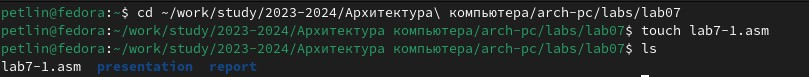{#fig:001 width=100%}  

Переходим в каталог для лабораторной работы № 7 и создаём файл lab7-1.asm.  

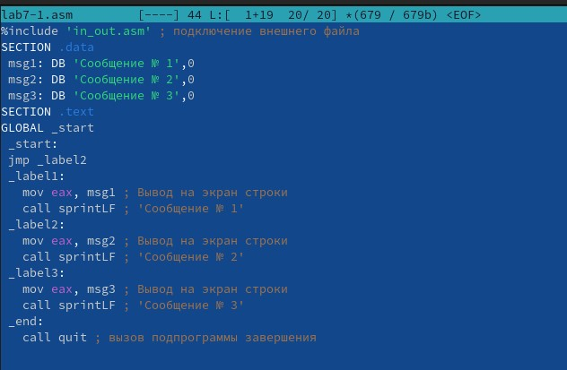{#fig:001 width=100%}  
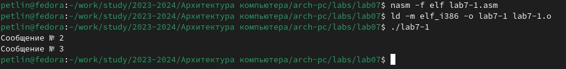{#fig:001 width=100%}  

Вводим в файл lab7-1.asm текст программы из листинга 7.1. Создаём исполняемый файл и запускаем его.  

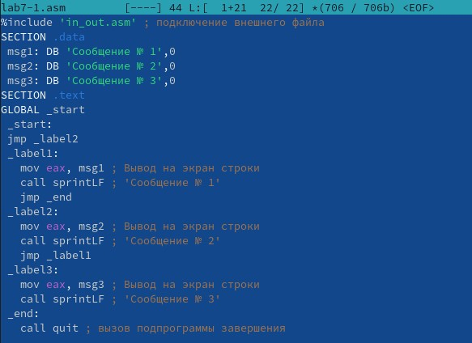{#fig:001 width=100%}  
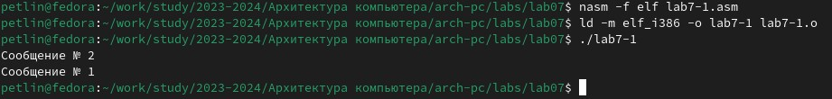{#fig:001 width=100%}  

Изменяем текст программы в соответствии с листингом 7.2. Создаём исполняемый файл и запускаем его.  

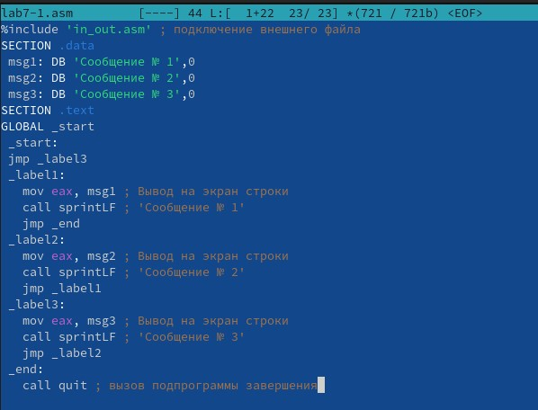{#fig:001 width=100%}  
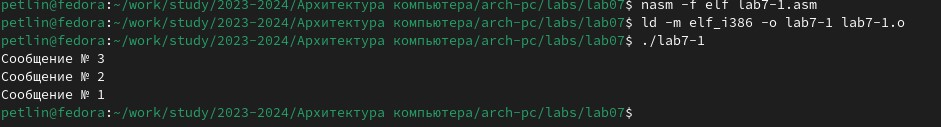{#fig:001 width=100%}  

Изменяем текст программы добавив или изменив инструкции jmp, чтобы вывод программы был следующим:  

       user@dk4n31:~$ ./lab7-1  
       Сообщение № 3  
       Сообщение № 2  
       Сообщение № 1  
       user@dk4n31:~$  

Проверяем корректность работы.  

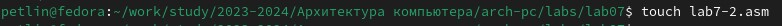{#fig:001 width=100%}  
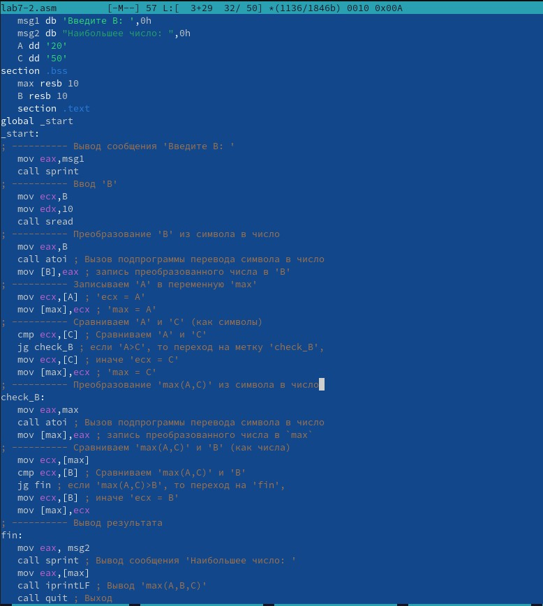{#fig:001 width=100%}  
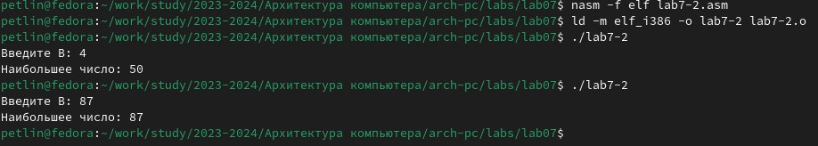{#fig:001 width=100%}  

Создаём файл lab7-2.asm в каталоге ~/work/arch-pc/lab07. Внимательно изучаем текст
программы из листинга 7.3 и вводим в lab7-2.asm. Создаём исполняемый файл и проверяем его работу для разных значений B.  

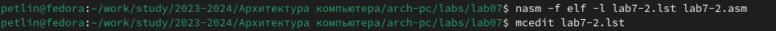{#fig:001 width=100%}  
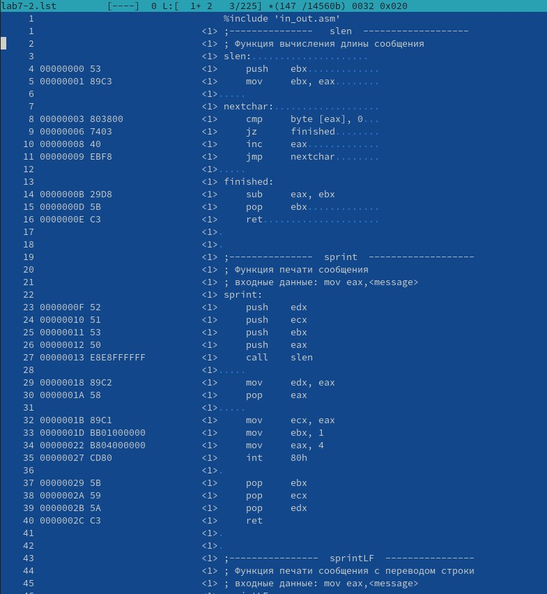{#fig:001 width=100%}  

Создаём файл листинга для программы из файла lab7-2.asm и открываем его с помощью текстового редактора.  

Пояснение строк:  

       Строка 33: 0000001D-адрес в сегменте кода, BB01000000-машинный код, mov ebx,1-присвоение переменной ecx значения 1  

       Строка 34: 00000022-адрес в сегменте кода, B804000000-машинный код, mov eax,4-присвоение переменной eax значения 4  

       Строка 35 00000027-адрес в сегменте кода, CD80-машинный код, int 80h-вызов ядра.  

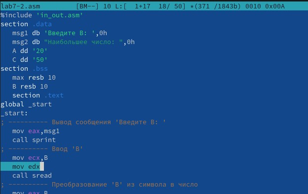{#fig:001 width=100%}  
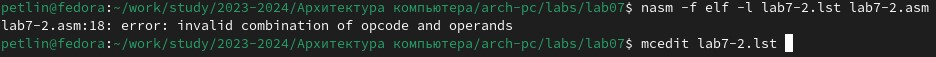{#fig:001 width=100%}  
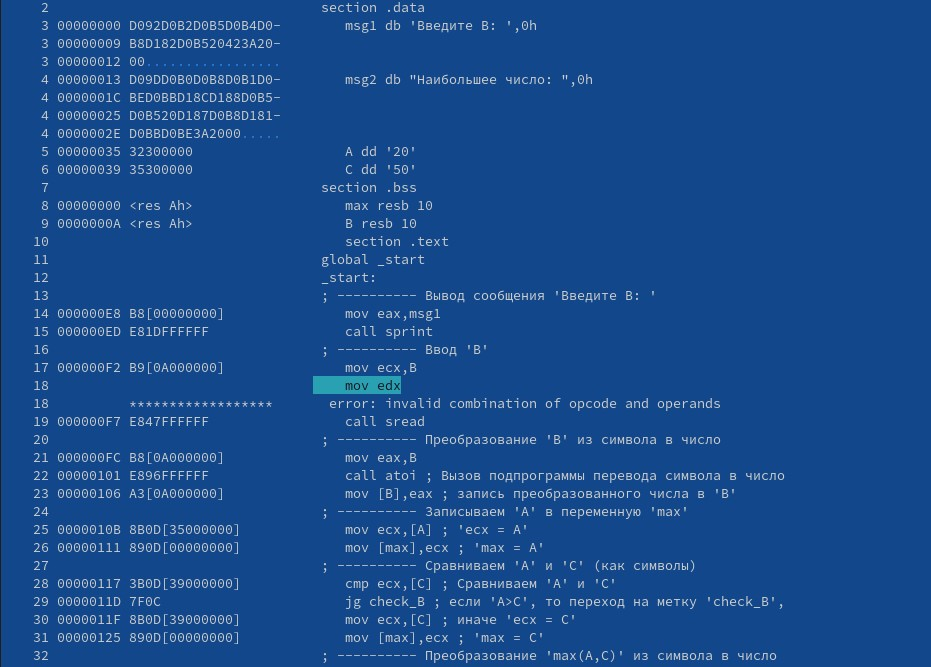{#fig:001 width=100%}  

Открываем файл с программой lab7-2.asm и в инструкции с двумя операндами
удаляем один операнд. Выполняем трансляцию с получением файла листинга. Мы получаем ошибку, однако файлы lab7-2 и lab7-2.lst все равно создаются. Открываем файл листинга и замечаем ошибку в строке, в которой мы удалили один операнд.

## Задание для самостоятельной работы

**Варинт №6**  

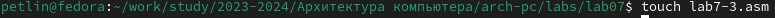{#fig:001 width=100%}  
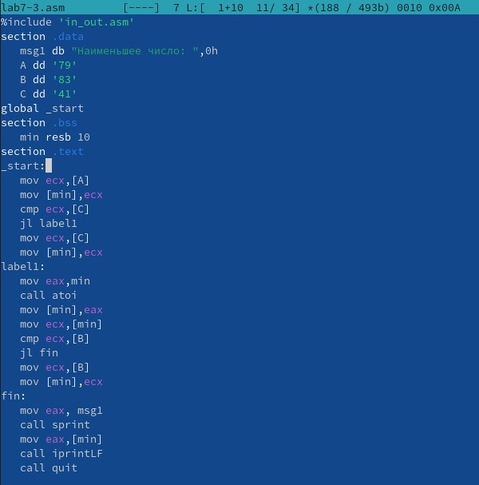{#fig:001 width=100%}  
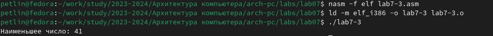{#fig:001 width=100%}  

Создаем файл lab7-3.asm, вписываем в него программу, которая будет искать наименьшее из трех чисел. Смотрим на результат выполнения программы и убеждаемся что всве работает верно.

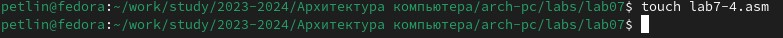{#fig:001 width=100%}  
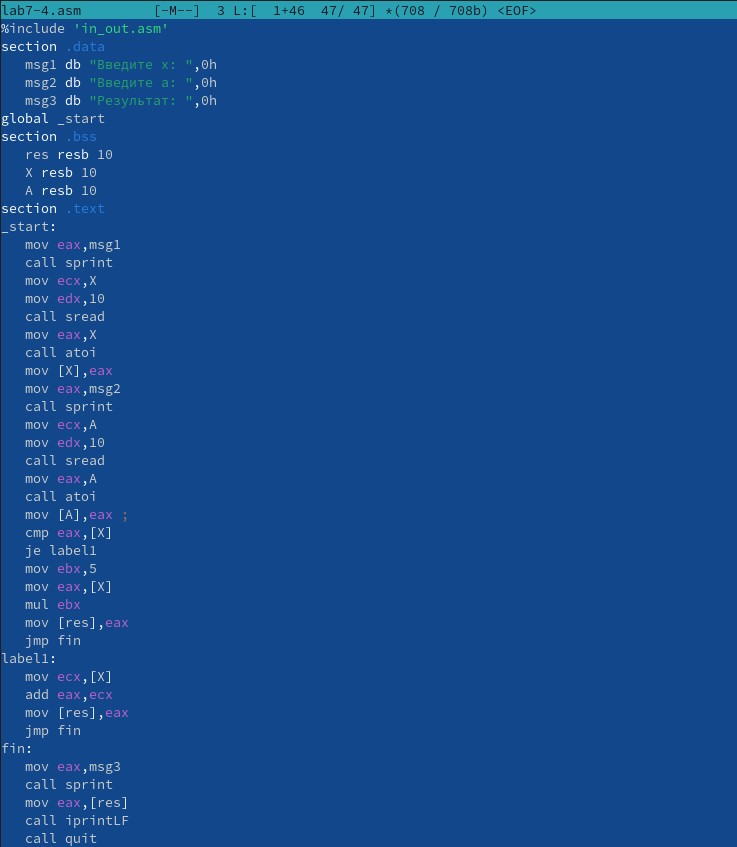{#fig:001 width=100%}  
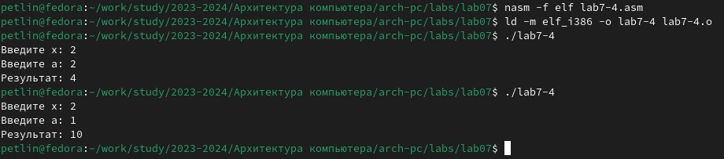{#fig:001 width=100%}  

Создаем файл lab7-4.asm, вписываем в него программу, которая будет выполнять действия описанные в данной нам функции. Смотрим на результат выполнения программы и убеждаемся что всве работает верно.

# Выводы

Мы изучили команды условного и безусловного переходов. Мы приобрели навыки написания
программ с использованием переходов. Мы познакомились с назначением и структурой файла
листинга.

# Список литературы{.unnumbered}

::: {#refs}
:::
1. GDB: The GNU Project Debugger. — URL: https://www.gnu.org/software/gdb/.  
2. GNU Bash Manual. — 2016. — URL: https://www.gnu.org/software/bash/manual/.  
3. Midnight Commander Development Center. — 2021. — URL: https://midnight-commander.
org/.  
4. NASM Assembly Language Tutorials. — 2021. — URL: https://asmtutor.com/.  
5. Newham C. Learning the bash Shell: Unix Shell Programming. — O’Reilly Media, 2005. —
354 с. — (In a Nutshell). — ISBN 0596009658. — URL: http://www.amazon.com/Learningbash-Shell-Programming-Nutshell/dp/0596009658.  
6. Robbins A. Bash Pocket Reference. — O’Reilly Media, 2016. — 156 с. — ISBN 978-1491941591.  
7. The NASM documentation. — 2021. — URL: https://www.nasm.us/docs.php.  
8. Zarrelli G. Mastering Bash. — Packt Publishing, 2017. — 502 с. — ISBN 9781784396879.  
9. Колдаев В. Д., Лупин С. А. Архитектура ЭВМ. — М. : Форум, 2018.  
10. Куляс О. Л., Никитин К. А. Курс программирования на ASSEMBLER. — М. : Солон-Пресс, 2017.  
11. Новожилов О. П. Архитектура ЭВМ и систем. — М. : Юрайт, 2016.  
12. Расширенный ассемблер: NASM. — 2021. — URL: https://www.opennet.ru/docs/RUS/nasm/.  
13. Робачевский А., Немнюгин С., Стесик О. Операционная система UNIX. — 2-е изд. — БХВПетербург, 2010. — 656 с. — ISBN 978-5-94157-538-1.  
14. Столяров А. Программирование на языке ассемблера NASM для ОС Unix. — 2-е изд. —
М. : МАКС Пресс, 2011. — URL: http://www.stolyarov.info/books/asm_unix.  
15. Таненбаум Э. Архитектура компьютера. — 6-е изд. — СПб. : Питер, 2013. — 874 с. —
(Классика Computer Science).  
16. Таненбаум Э., Бос Х. Современные операционные системы. — 4-е изд. — СПб. : Питер, 2015. — 1120 с. — (Классика Computer Science).  
