---
## Front matter
title: "Отчёт по лабораторной работе №8"

author: "Петлин Артём Дмитриевич"

## Generic otions
lang: ru-RU
toc-title: "Содержание"

## Bibliography
bibliography: bib/cite.bib
csl: pandoc/csl/gost-r-7-0-5-2008-numeric.csl

## Pdf output format
toc: true # Table of contents
toc-depth: 2
lof: true # List of figures
lot: true # List of tables
fontsize: 12pt
linestretch: 1.5
papersize: a4
documentclass: scrreprt
## I18n polyglossia
polyglossia-lang:
  name: russian
  options:
	- spelling=modern
	- babelshorthands=true
polyglossia-otherlangs:
  name: english
## I18n babel
babel-lang: russian
babel-otherlangs: english
## Fonts
mainfont: IBM Plex Serif
romanfont: IBM Plex Serif
sansfont: IBM Plex Sans
monofont: IBM Plex Mono
mathfont: STIX Two Math
mainfontoptions: Ligatures=Common,Ligatures=TeX,Scale=0.94
romanfontoptions: Ligatures=Common,Ligatures=TeX,Scale=0.94
sansfontoptions: Ligatures=Common,Ligatures=TeX,Scale=MatchLowercase,Scale=0.94
monofontoptions: Scale=MatchLowercase,Scale=0.94,FakeStretch=0.9
mathfontoptions:
## Biblatex
biblatex: true
biblio-style: "gost-numeric"
biblatexoptions:
  - parentracker=true
  - backend=biber
  - hyperref=auto
  - language=auto
  - autolang=other*
  - citestyle=gost-numeric
## Pandoc-crossref LaTeX customization
figureTitle: "Рис."
tableTitle: "Таблица"
listingTitle: "Листинг"
lofTitle: "Список иллюстраций"
lotTitle: "Список таблиц"
lolTitle: "Листинги"
## Misc options
indent: true
header-includes:
  - \usepackage{indentfirst}
  - \usepackage{float} # keep figures where there are in the text
  - \floatplacement{figure}{H} # keep figures where there are in the text
---

# Цель работы

Приобретение навыков написания программ с использованием циклов и обработкой
аргументов командной строки.

# Задание

1. Напишите программу, которая находит сумму значений функции 𝑓(𝑥) для 𝑥 = 𝑥1, 𝑥2, ..., 𝑥𝑛, т.е. программа должна выводить значение 𝑓(𝑥1) + 𝑓(𝑥2) + ... + 𝑓(𝑥𝑛). Значения 𝑥𝑖 передаются как аргументы. Вид функции 𝑓(𝑥) выбрать из таблицы 8.1 вариантов заданий в соответствии с вариантом, полученным при выполнении лабораторной работы № 7. Создайте исполняемый файл и проверьте его работу на нескольких наборах 𝑥 = 𝑥1, 𝑥2, ..., 𝑥𝑛.  

       Пример работы программы для функции 𝑓(𝑥) = 𝑥 + 2 и набора 𝑥1 = 1, 𝑥2 = 2, 𝑥3 = 3, 𝑥4 = 4:  

       user@dk4n31:~$ ./main 1 2 3 4  
       Функция: f(x)=x+2  
       Результат: 18  
       user@dk4n31:~$  

# Теоретическое введение

## Организация стека

Стек — это структура данных, организованная по принципу LIFO («Last In — First Out»
или «последним пришёл — первым ушёл»). Стек является частью архитектуры процессора и
реализован на аппаратном уровне. Для работы со стеком в процессоре есть специальные
регистры (ss, bp, sp) и команды.  
Основной функцией стека является функция сохранения адресов возврата и передачи
аргументов при вызове процедур. Кроме того, в нём выделяется память для локальных
переменных и могут временно храниться значения регистров.  
Стек имеет вершину, адрес последнего добавленного элемента, который хранится в регистре esp (указатель стека). Противоположный конец стека называется дном. Значение,
помещённое в стек последним, извлекается первым. При помещении значения в стек указатель стека уменьшается, а при извлечении — увеличивается.  
Для стека существует две основные операции:  

   - добавление элемента в вершину стека (push);
   - извлечение элемента из вершины стека (pop).

### Добавление элемента в стек.

Команда push размещает значение в стеке, т.е. помещает значение в ячейку памяти, на
которую указывает регистр esp, после этого значение регистра esp увеличивается на 4.
Данная команда имеет один операнд — значение, которое необходимо поместить в стек.  
    
    Примеры:  
    
       push -10 ; Поместить -10 в стек  
       push ebx ; Поместить значение регистра ebx в стек  
       push [buf] ; Поместить значение переменной buf в стек  
       push word [ax] ; Поместить в стек слово по адресу в ax  

Существует ещё две команды для добавления значений в стек. Это команда pusha, которая
помещает в стек содержимое всех регистров общего назначения в следующем порядке: ах,
сх, dx, bх, sp, bp, si, di. А также команда pushf, которая служит для перемещения в стек
содержимого регистра флагов. Обе эти команды не имеют операндов.

### Извлечение элемента из стека

Команда pop извлекает значение из стека, т.е. извлекает значение из ячейки памяти, на
которую указывает регистр esp, после этого уменьшает значение регистра esp на 4. У этой
команды также один операнд, который может быть регистром или переменной в памяти.  
Нужно помнить, что извлечённый из стека элемент не стирается из памяти и остаётся как
“мусор”, который будет перезаписан при записи нового значения в стек.  
     
     Примеры:  

       pop eax ; Поместить значение из стека в регистр eax  
       pop [buf] ; Поместить значение из стека в buf  
       pop word[si] ; Поместить значение из стека в слово по адресу в si  

Аналогично команде записи в стек существует команда popa, которая восстанавливает
из стека все регистры общего назначения, и команда popf для перемещения значений из
вершины стека в регистр флагов.

## Инструкции организации циклов

Для организации циклов существуют специальные инструкции. Для всех инструкций
максимальное количество проходов задаётся в регистре ecx. Наиболее простой является инструкция loop. Она позволяет организовать безусловный цикл, типичная структура которого
имеет следующий вид:  

       mov ecx, 100 ; Количество проходов  
       NextStep:  
       ...  
       ... ; тело цикла  
       ...  
       loop NextStep ; Повторить `ecx` раз от метки NextStep  

Иструкция loop выполняется в два этапа. Сначала из регистра ecx вычитается единица и
его значение сравнивается с нулём. Если регистр не равен нулю, то выполняется переход к
указанной метке. Иначе переход не выполняется и управление передаётся команде, которая
следует сразу после команды loop.

# Выполнение лабораторной работы

## Реализация циклов в NASM

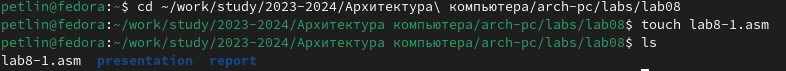{#fig:001 width=100%}
{#fig:001 width=100%}
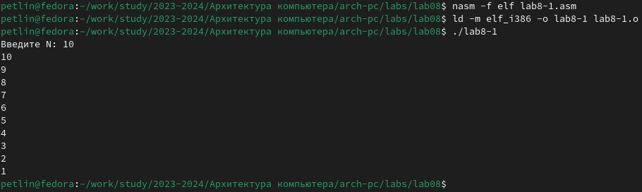{#fig:001 width=100%}

Переходим в каталог ЛБ8 и создаём файл lab8-1.asm, в который вводим текст программы из листинга 8.1. Создаём исполняем файл и проверяем его работу.

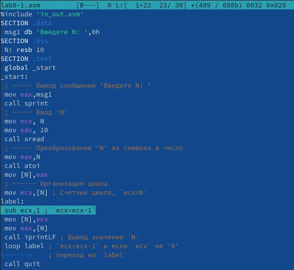{#fig:001 width=100%}
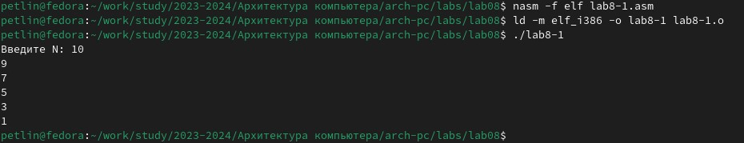{#fig:001 width=100%}

Изменяем текст программы добавив изменение значение регистра ecx в цикле. Создаём исполняем файл и проверяем его работу. На вход подается число 10, в цикле label регистр ecx уменьшается на 2. Число проходов цикла не соответсвует числу N, так как уменьшается на 2.

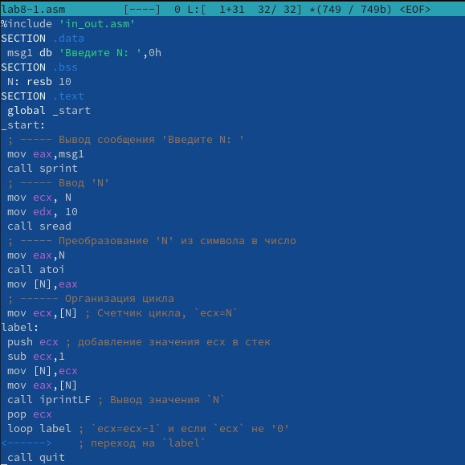{#fig:001 width=100%}
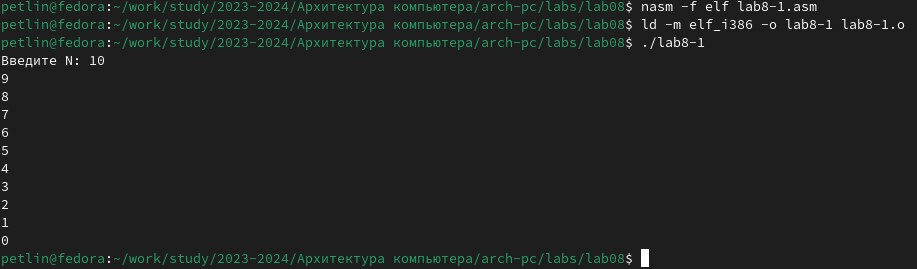{#fig:001 width=100%}

Вносим изменения в текст программы добавив команды push и pop (добавления в стек и извлечения из стека) для сохранения значения счетчика цикла loop. Создаём исполняем файл и проверяем его работу. В данном случае число проходов цикла соответсвует числу N.

## Обработка аргументов командной строки

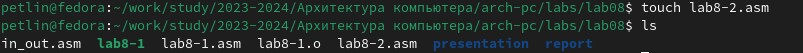{#fig:001 width=100%}
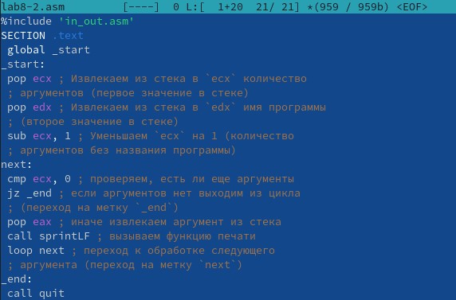{#fig:001 width=100%}
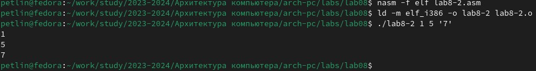{#fig:001 width=100%}

Cоздаём файл lab8-2.asm, в который вводим текст программы из листинга 8.2. Создаём исполняем файл и проверяем его работу. Программа обработала 3 аргумента.

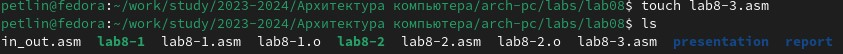{#fig:001 width=100%}
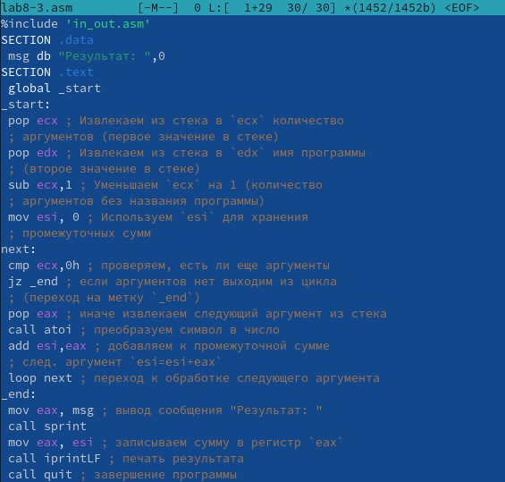{#fig:001 width=100%}
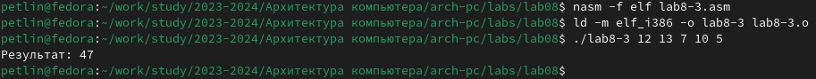{#fig:001 width=100%}

Cоздаём файл lab8-3.asm, в который вводим текст программы из листинга 8.3. Создаём исполняем файл и проверяем его работу. Программа работает корректно.

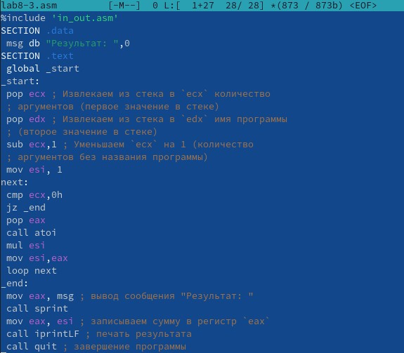{#fig:001 width=100%}
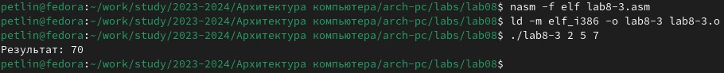{#fig:001 width=100%}

Изменяем текст программы из листинга 8.3 для вычисления произведения аргументов командной строки. Создаём исполняем файл и проверяем его работу. Программа работает корректно.

# Задания для самостоятельной работы

**Вариант №6**  
       
       Функция: f(x)=4x-3:
       
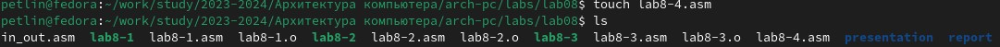{#fig:001 width=100%}
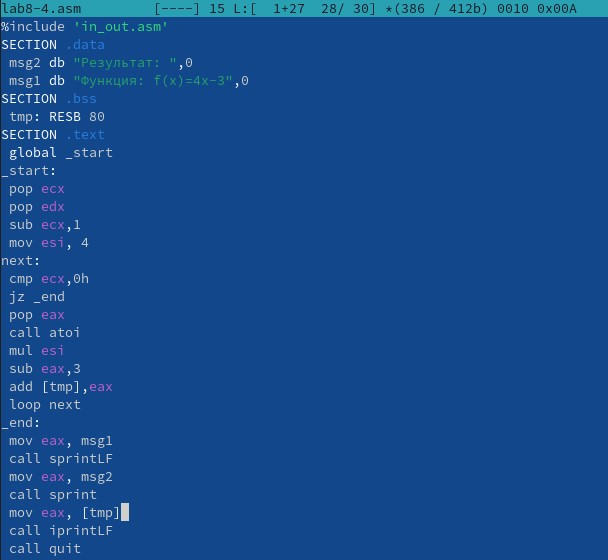{#fig:001 width=100%}
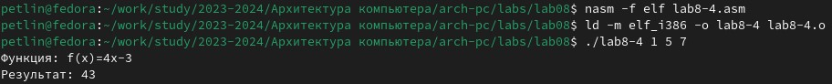{#fig:001 width=100%}

Cоздаём файл lab8-4.asm, в который вводим текст программы, вычисляющей сумму значений функции для аргументов. Создаём исполняем файл и проверяем его работу. Программа работает корректно.

# Выводы

Мы приобрели навыков написания программ с использованием циклов и обработкой аргументов командной строки.

# Список литературы{.unnumbered}

::: {#refs}
:::
1. GDB: The GNU Project Debugger. — URL: https://www.gnu.org/software/gdb/.  
2. GNU Bash Manual. — 2016. — URL: https://www.gnu.org/software/bash/manual/.  
3. Midnight Commander Development Center. — 2021. — URL: https://midnight-commander.
org/.  
4. NASM Assembly Language Tutorials. — 2021. — URL: https://asmtutor.com/.  
5. Newham C. Learning the bash Shell: Unix Shell Programming. — O’Reilly Media, 2005. —
354 с. — (In a Nutshell). — ISBN 0596009658. — URL: http://www.amazon.com/Learningbash-Shell-Programming-Nutshell/dp/0596009658.  
6. Robbins A. Bash Pocket Reference. — O’Reilly Media, 2016. — 156 с. — ISBN 978-1491941591.  
7. The NASM documentation. — 2021. — URL: https://www.nasm.us/docs.php.  
8. Zarrelli G. Mastering Bash. — Packt Publishing, 2017. — 502 с. — ISBN 9781784396879.  
9. Колдаев В. Д., Лупин С. А. Архитектура ЭВМ. — М. : Форум, 2018.  
10. Куляс О. Л., Никитин К. А. Курс программирования на ASSEMBLER. — М. : Солон-Пресс, 2017.  
11. Новожилов О. П. Архитектура ЭВМ и систем. — М. : Юрайт, 2016.  
12. Расширенный ассемблер: NASM. — 2021. — URL: https://www.opennet.ru/docs/RUS/nasm/.  
13. Робачевский А., Немнюгин С., Стесик О. Операционная система UNIX. — 2-е изд. — БХВПетербург, 2010. — 656 с. — ISBN 978-5-94157-538-1.  
14. Столяров А. Программирование на языке ассемблера NASM для ОС Unix. — 2-е изд. —
М. : МАКС Пресс, 2011. — URL: http://www.stolyarov.info/books/asm_unix.  
15. Таненбаум Э. Архитектура компьютера. — 6-е изд. — СПб. : Питер, 2013. — 874 с. —
(Классика Computer Science).  
16. Таненбаум Э., Бос Х. Современные операционные системы. — 4-е изд. — СПб. : Питер, 2015. — 1120 с. — (Классика Computer Science).  
