---
## Front matter
title: "Отчёт по лабораторной работе №9"

author: "Петлин Артём Дмитриевич"

## Generic otions
lang: ru-RU
toc-title: "Содержание"

## Bibliography
bibliography: bib/cite.bib
csl: pandoc/csl/gost-r-7-0-5-2008-numeric.csl

## Pdf output format
toc: true # Table of contents
toc-depth: 2
lof: true # List of figures
lot: true # List of tables
fontsize: 12pt
linestretch: 1.5
papersize: a4
documentclass: scrreprt
## I18n polyglossia
polyglossia-lang:
  name: russian
  options:
	- spelling=modern
	- babelshorthands=true
polyglossia-otherlangs:
  name: english
## I18n babel
babel-lang: russian
babel-otherlangs: english
## Fonts
mainfont: IBM Plex Serif
romanfont: IBM Plex Serif
sansfont: IBM Plex Sans
monofont: IBM Plex Mono
mathfont: STIX Two Math
mainfontoptions: Ligatures=Common,Ligatures=TeX,Scale=0.94
romanfontoptions: Ligatures=Common,Ligatures=TeX,Scale=0.94
sansfontoptions: Ligatures=Common,Ligatures=TeX,Scale=MatchLowercase,Scale=0.94
monofontoptions: Scale=MatchLowercase,Scale=0.94,FakeStretch=0.9
mathfontoptions:
## Biblatex
biblatex: true
biblio-style: "gost-numeric"
biblatexoptions:
  - parentracker=true
  - backend=biber
  - hyperref=auto
  - language=auto
  - autolang=other*
  - citestyle=gost-numeric
## Pandoc-crossref LaTeX customization
figureTitle: "Рис."
tableTitle: "Таблица"
listingTitle: "Листинг"
lofTitle: "Список иллюстраций"
lotTitle: "Список таблиц"
lolTitle: "Листинги"
## Misc options
indent: true
header-includes:
  - \usepackage{indentfirst}
  - \usepackage{float} # keep figures where there are in the text
  - \floatplacement{figure}{H} # keep figures where there are in the text
---

# Цель работы

Приобретение навыков написания программ с использованием подпрограмм. Знакомство
с методами отладки при помощи GDB и его основными возможностями.

# Задание

1. Преобразуйте программу из лабораторной работы №8 (Задание №1 для самостоятельной работы), реализовав вычисление значения функции 𝑓(𝑥) как подпрограмму.
2. В листинге 9.3 приведена программа вычисления выражения (3 + 2) ∗ 4 + 5. При запуске
данная программа дает неверный результат. Проверьте это. С помощью отладчика GDB,
анализируя изменения значений регистров, определите ошибку и исправьте ее.

# Теоретическое введение

## Понятие об отладке

Отладка — это процесс поиска и исправления ошибок в программе. В общем случае его
можно разделить на четыре этапа:  

   - обнаружение ошибки;
   - поиск её местонахождения;
   - определение причины ошибки;
   - исправление ошибки.
   
Можно выделить следующие типы ошибок:

   - синтаксические ошибки — обнаруживаются во время трансляции исходного кода и вызваны нарушением ожидаемой формы или структуры языка;
   - семантические ошибки — являются логическими и приводят к тому, что программазапускается, отрабатывает, но не даёт желаемого результата;
   - ошибки в процессе выполнения — не обнаруживаются при трансляции и вызывают прерывание выполнения программы (например, это ошибки, связанные с переполнением или делением на ноль).
   
Второй этап — поиск местонахождения ошибки. Некоторые ошибки обнаружить довольно трудно. Лучший способ найти место в программе, где находится ошибка, это разбить
программу на части и произвести их отладку отдельно друг от друга.  
Третий этап — выяснение причины ошибки. После определения местонахождения ошибки
обычно проще определить причину неправильной работы программы.  
Последний этап — исправление ошибки. После этого при повторном запуске программы,
может обнаружиться следующая ошибка, и процесс отладки начнётся заново.

## Методы отладки

Наиболее часто применяют следующие методы отладки:

   - создание точек контроля значений на входе и выходе участка программы (например, вывод промежуточных значений на экран — так называемые диагностические сообщения);
   - использование специальных программ-отладчиков.

Отладчики позволяют управлять ходом выполнения программы, контролировать и изменять данные. Это помогает быстрее найти место ошибки в программе и ускорить её
исправление. Наиболее популярные способы работы с отладчиком — это использование
точек останова и выполнение программы по шагам.  
Пошаговое выполнение — это выполнение программы с остановкой после каждой строчки,
чтобы программист мог проверить значения переменных и выполнить другие действия. 
Точки останова — это специально отмеченные места в программе, в которых программаотладчик приостанавливает выполнение программы и ждёт команд. Наиболее популярные
виды точек останова:  

   - Breakpoint — точка останова (остановка происходит, когда выполнение доходит до определённой строки, адреса или процедуры, отмеченной программистом);
   - Watchpoint — точка просмотра (выполнение программы приостанавливается, если программа обратилась к определённой переменной: либо считала её значение, либо изменила его).

Точки останова устанавливаются в отладчике на время сеанса работы с кодом программы, т.е. они сохраняются до выхода из программы-отладчика или до смены отлаживаемой
программы.

## Основные возможности отладчика GDB

GDB (GNU Debugger — отладчик проекта GNU) [1] работает на многих UNIX-подобных
системах и умеет производить отладку многих языков программирования. GDB предлагает
обширные средства для слежения и контроля за выполнением компьютерных программ. Отладчик не содержит собственного графического пользовательского интерфейса и использует
стандартный текстовый интерфейс консоли. Однако для GDB существует несколько сторонних графических надстроек, а кроме того, некоторые интегрированные среды разработки
используют его в качестве базовой подсистемы отладки.  
Отладчик GDB (как и любой другой отладчик) позволяет увидеть, что происходит «внутри»
программы в момент её выполнения или что делает программа в момент сбоя.  
GDB может выполнять следующие действия:  

   - начать выполнение программы, задав всё, что может повлиять на её поведение;
   - остановить программу при указанных условиях;
   - исследовать, что случилось, когда программа остановилась;
   - изменить программу так, чтобы можно было поэкспериментировать с устранением эффектов одной ошибки и продолжить выявление других.

## Запуск отладчика GDB; выполнение программы; выход

Синтаксис команды для запуска отладчика имеет следующий вид:  

       gdb [опции] [имя_файла | ID процесса]  

После запуска gdb выводит текстовое сообщение — так называемое «nice GDB logo». В
следующей строке появляется приглашение (gdb) для ввода команд.  
Далее приведён список некоторых команд GDB.  
Команда run (сокращённо r) — запускает отлаживаемую программу в оболочке GDB.  
Если точки останова не были установлены, то программа выполняется и выводятся сообщения:  

       (gdb) run  
       Starting program: test  
       Program exited normally.  
       (gdb)  

Если точки останова были заданы, то отладчик останавливается на соответствующей
команде и выдаёт номер точки останова, адрес и дополнительную информацию — текущую
строку, имя процедуры, и др.  
Команда kill (сокращённо k) прекращает отладку программы, после чего следует вопрос
о прекращении процесса отладки:  

       Kill the program being debugged? (y or n) y  

Если в ответ введено y (то есть «да»), отладка программы прекращается. Командой
run её можно начать заново, при этом все точки останова (breakpoints), точки просмотра
(watchpoints) и точки отлова (catchpoints) сохраняются.  
Для выхода из отладчика используется команда quit (или сокращённо q):  

       (gdb) q  

## Дизассемблирование программы

Если есть файл с исходным текстом программы, а в исполняемый файл включена информация о номерах строк исходного кода, то программу можно отлаживать, работая в отладчике
непосредственно с её исходным текстом. Чтобы программу можно было отлаживать на
уровне строк исходного кода, она должна быть откомпилирована с ключом -g.  
Посмотреть дизассемблированный код программы можно с помощью команды
disassemble <метка/адрес>:  

       (gdb) disassemble _start  

Существует два режима отображения синтаксиса машинных команд: режим Intel, используемый в том числе в NASM, и режим ATT (значительно отличающийся внешне). По
умолчанию в дизассемблере GDB принят режим ATT. Переключиться на отображение команд
с привычным Intel’овским синтаксисом можно, введя команду set disassembly-flavor
intel.  

## Точки останова

Установить точку останова можно командой break (кратко b). Типичный аргумент этой
команды — место установки. Его можно задать как имя метки или как адрес. Чтобы не было
путаницы с номерами, перед адресом ставится «звёздочка»:  

       (gdb) break *<адрес>  
       (gdb) b <метка>  
       
Информацию о всех установленных точках останова можно вывести командой info (кратко i):  

       (gdb) info breakpoints  
       (gdb) i b  

Для того чтобы сделать неактивной какую-нибудь ненужную точку останова, можно воспользоваться командой disable:
disable breakpoint <номер точки останова>  
Обратно точка останова активируется командой enable:  

       enable breakpoint <номер точки останова>  

Если же точка останова в дальнейшем больше не нужна, она может быть удалена с помощью
команды delete:  

       (gdb) delete breakpoint <номер точки останова>  

Ввод этой команды без аргумента удалит все точки останова.
Информацию о командах этого раздела можно получить, введя  

       help breakpoints  

## Пошаговая отладка

Для продолжения остановленной программы используется команда continue (c) (gdb)
с [аргумент]. Выполнение программы будет происходить до следующей точки останова.
В качестве аргумента может использоваться целое число 𝑁, которое указывает отладчику
проигнорировать 𝑁 − 1 точку останова (выполнение остановится на 𝑁-й точке).  
Команда stepi (кратко sI) позволяет выполнять программу по шагам, т.е. данная команда
выполняет ровно одну инструкцию:  

       (gdb) si [аргумент]  

При указании в качестве аргумента целого числа 𝑁 отладчик выполнит команду step 𝑁
раз при условии, что не будет точек останова или выполнение программы не прервётся по
другим причинам.  
Команда nexti (или ni) аналогична stepi, но вызов процедуры (функции) трактуется
отладчиком как одна инструкция:  

       (gdb) ni [аргумент]  

Информацию о командах этого раздела можно получить, введя  

       (gdb) help running  

## Работа с данными программы в GDB

Как уже упоминалось, отладчик может показывать содержимое ячеек памяти и регистров,
а при необходимости позволяет вручную изменять значения регистров и переменных.  
Посмотреть содержимое регистров можно с помощью команды info registers (или i
r):  

       (gdb) info registers  

Для отображения содержимого памяти можно использовать команду x/NFU <адрес>, выдаёт содержимое ячейки памяти по указанному адресу.NFU задает формат, в котором выводятся
данные.  

Например,x/4uh 0x63450— это запрос на вывод четырёх полуслов (h) из памяти в формате
беззнаковых десятичных целых (u), начиная с адреса 0x63450.  
Чтобы посмотреть значения регистров используется команда print /F <val> (сокращенно p). Перед именем регистра обязательно ставится префикс $. Например, команда p/x $ecx
выводит значение регистра в шестнадцатеричном формате.  
Изменить значение для регистра или ячейки памяти можно с помощью команды set,
задав ей в качестве аргумента имя регистра или адрес. При этом перед именем регистра
ставится префикс $, а перед адресом нужно указать в фигурных скобках тип данных (размер
сохраняемого значения; в качестве типа данных можно использовать типы языка Си).  
Справку о любой команде gdb можно получить, введя  

       (gdb) help [имя_команды]  

## Понятие подпрограммы

Подпрограмма — это, как правило, функционально законченный участок кода, который
можно многократно вызывать из разных мест программы. В отличие от простых переходов
из подпрограмм существует возврат на команду, следующую за вызовом.  
Если в программе встречается одинаковый участок кода, его можно оформить в виде
подпрограммы, а во всех нужных местах поставить её вызов. При этом подпрограмма будет содержаться в коде в одном экземпляре, что позволит уменьшить размер кода всей
программы.  

### Инструкция call и инструкция ret

Для вызова подпрограммы из основной программы используется инструкция call, которая заносит адрес следующей инструкции в стек и загружает в регистр eip адрес соответствующей подпрограммы, осуществляя таким образом переход. Затем начинается выполнение
подпрограммы, которая, в свою очередь, также может содержать подпрограммы.  
Подпрограмма завершается инструкцией ret, которая извлекает из стека адрес, занесённый туда соответствующей инструкцией call, и заносит его в eip. После этого выполнение
основной программы возобновится с инструкции, следующей за инструкцией call.
Подпрограмма может вызываться как из внешнего файла, так и быть частью основной
программы.  
Важно помнить, что если в подпрограмме занести что-то в стек и не извлечь,то на вершине
стека окажется не адрес возврата и это приведёт к ошибке выхода из подпрограммы. Кроме
того, надо помнить, что подпрограмма без команды возврата не вернётся в точку вызова, а
будет выполнять следующий за подпрограммой код, как будто он является её продолжением.

# Выполнение лабораторной работы

## Реализация подпрограмм в NASM

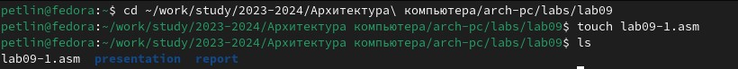{#fig:001 width=100%}
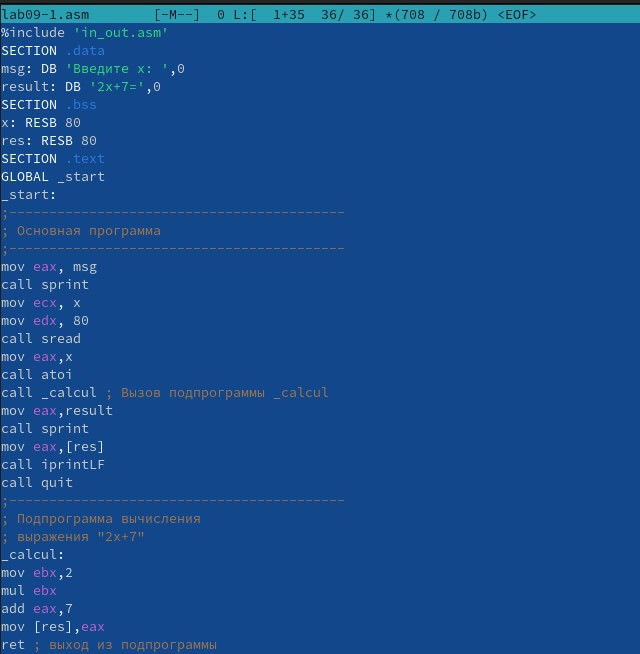{#fig:001 width=100%}
{#fig:001 width=100%}

Переходим в каталог для выполнения лабораторной работы № 9 и создаём файл lab09-1.asm, в который вписываем текст программы из листинга 9.1. Создаём исполняемый
файл и проверяем его работу.

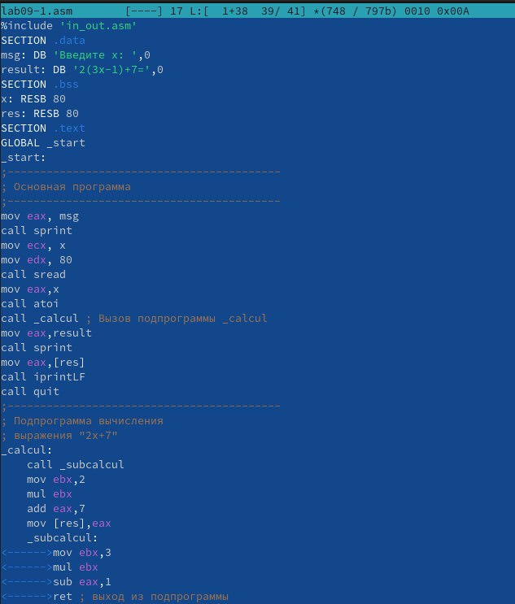{#fig:001 width=100%}
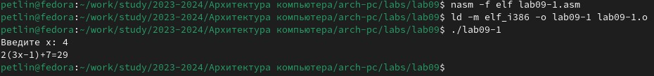{#fig:001 width=100%}

Изменяем текст программы, добавив подпрограмму в подпрограмму.

## Отладка программам с помощью GDB

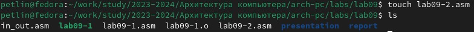{#fig:001 width=100%}
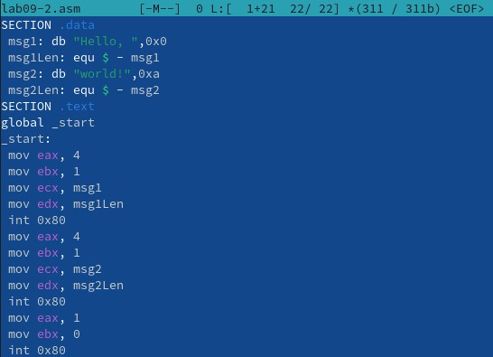{#fig:001 width=100%}
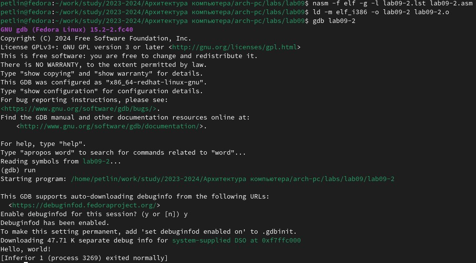{#fig:001 width=100%}

Создаём файл lab09-2.asm, в который вписываем текст программы из листинга 9.2. Создаем исполняемый файл с использованием откладчика GDB. Проверяем работу программы, запустив ее в оболочке GDB с помощью команды run.

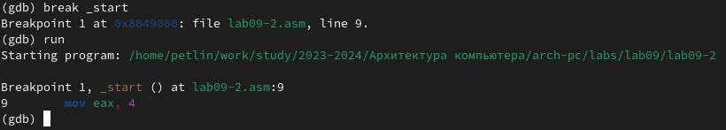{#fig:001 width=100%}

Для более подробного анализа программы устанавливаем брейкпоинт на метку _start, с которой начинается выполнение любой ассемблерной программы, и запускаем её.

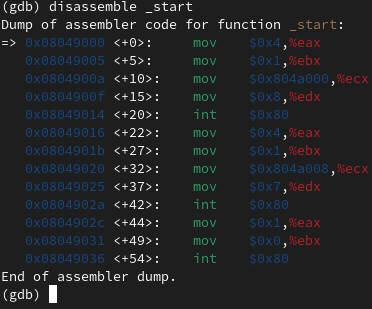{#fig:001 width=100%}

Смотрим дисассимилированный код программы с помощью команды disassemble начиная с метки _start.

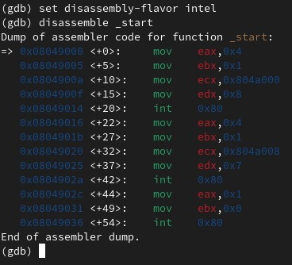{#fig:001 width=100%}

Переключаемся на отображение команд с Intel’овским синтаксисом, введя команду set disassembly-flavor intel.  
Различия:  

       Порядок перечисления операндов и обозначение регистров в ATT используются символ "%" для обозначения регистра.

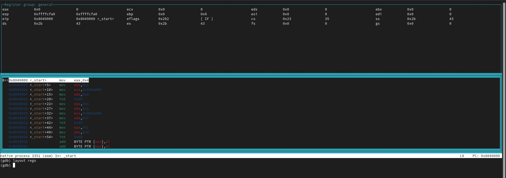{#fig:001 width=100%}

Включаем режим псевдографики для более удобного анализа программы.

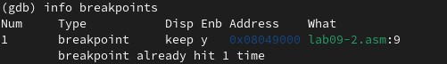{#fig:001 width=100%}

На предыдущих шагах мы установили точка останова по имени метки (_start). Проверяем это с помощью команды info breakpoints.

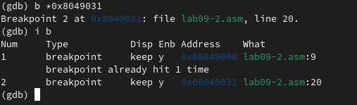{#fig:001 width=100%}

Устанавливаем еще одну точку останова по адресу инструкции.

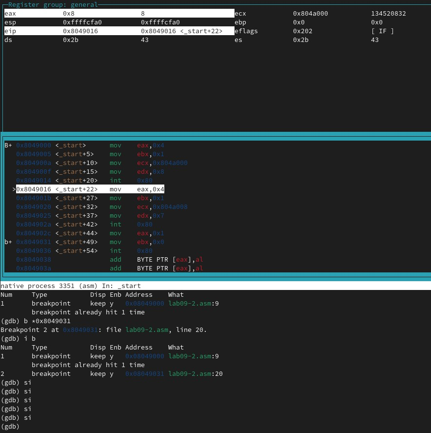{#fig:001 width=100%}

Выполните 5 инструкций с помощью команды stepi. Изменяются регистры ebx, ecx, edx, eax, eip.

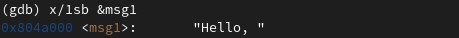{#fig:001 width=100%}

Смотрим значение переменной msg1 по имени

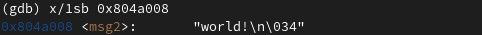{#fig:001 width=100%}

Смотрим значение переменной msg2 по адресу

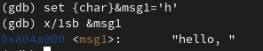{#fig:001 width=100%}

Изменяем первый символ переменной msg1

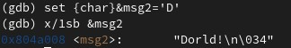{#fig:001 width=100%}

Изменяем первый символ переменной msg2

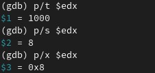{#fig:001 width=100%}

Смотрим значения регистра edx в различных форматах.

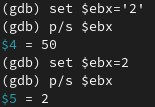{#fig:001 width=100%}

С помощью команды set изменяем значение разными способами регистра ebx. Во второй раз команда без кавычек присваивает регистру вводимое значение, поэтому вывод различен.

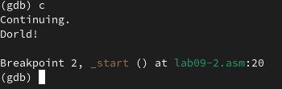{#fig:001 width=100%}

Завершаем выполнение программы и выходим из GDB.

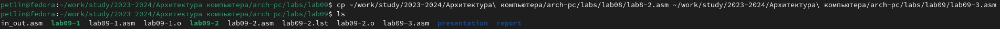{#fig:001 width=100%}

Копируем файл lab8-2.asm, созданный при выполнении лабораторной работы №8, с программой выводящей на экран аргументы командной строки (Листинг 8.2) в файл с именем lab09-3.asm.

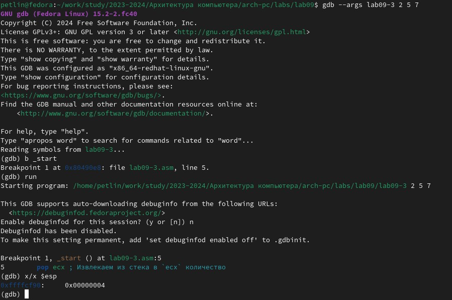{#fig:001 width=100%}

Создаём исполняемый файл, указываем аргументы и запускаем его в оболочке GDB. Устанавливаем точку останова перед первой инструкцией в программе и запускаем ее. Смотрим количество аргументов.

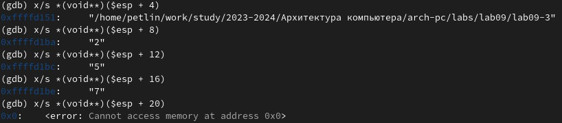{#fig:001 width=100%}

Смотрим позиции стека. Шаг изменения адреса равен 4, потому что регистры имеют размерность 4 байта.

## Задание для самостоятельной работы
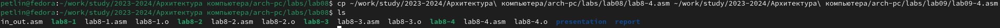{#fig:001 width=100%}
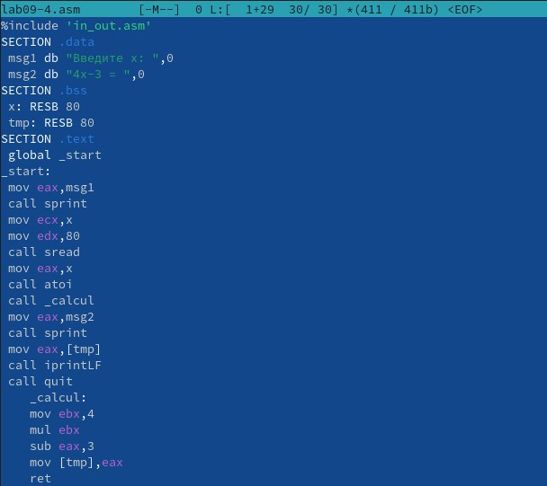{#fig:001 width=100%}
{#fig:001 width=100%}

Копируем файл с текстом программы для задания для самостоятельной работы из лабораторной работы №8. Изменяем текст программы, реализовав вычисление функции как подпрограмму. Создаем исполняем файл и проверяем его работу. Программа работает корректно.

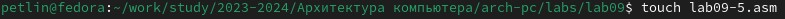{#fig:001 width=100%}
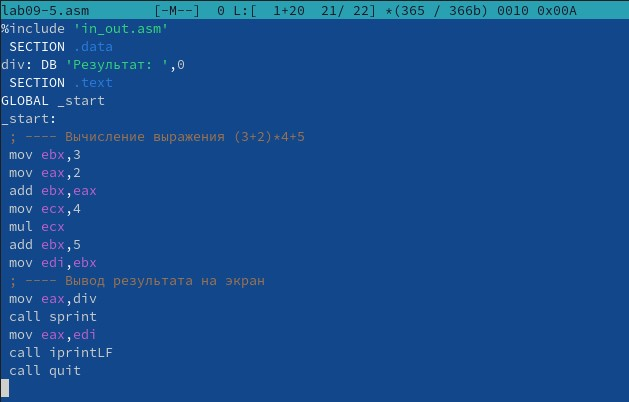{#fig:001 width=100%}
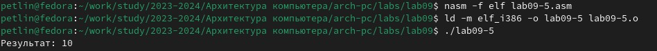{#fig:001 width=100%}

Создаём файл lab09-5.asm, в который вписываем текст программы из листинга 9.3. Создаем исполняемый файл и проверяем его работу. Программа работает неверно.

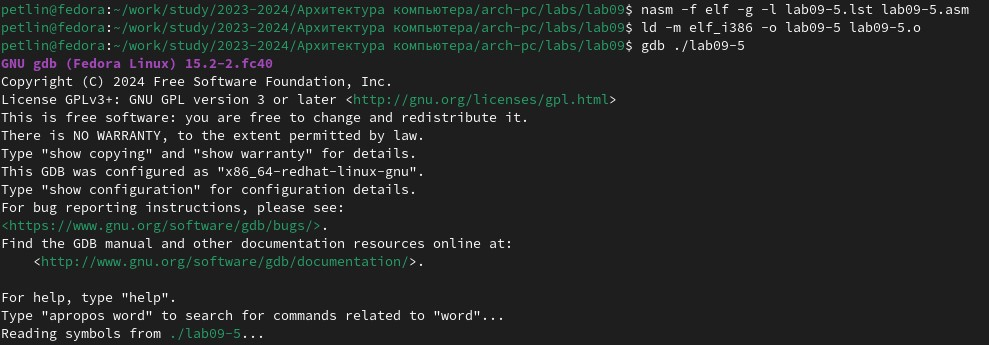{#fig:001 width=100%}
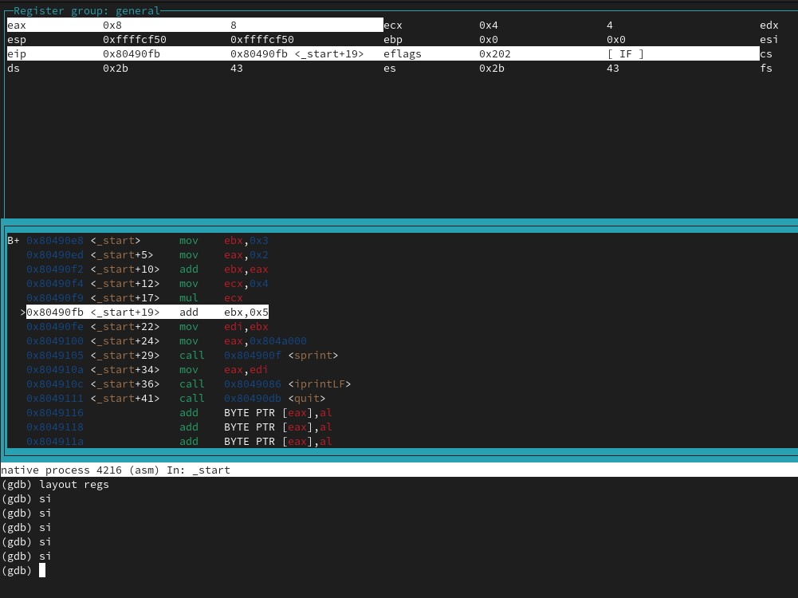{#fig:001 width=100%}

Создаем исполняемый файл и запускаем его в оболочке GDB. Смотрим на изменение значение регистров с помощью команды si.

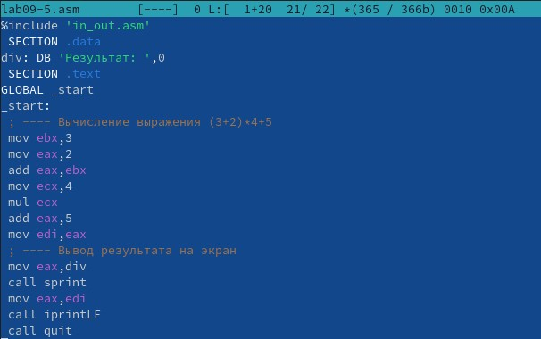{#fig:001 width=100%}
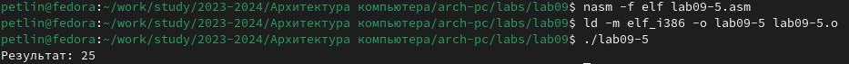{#fig:001 width=100%}

Изменяем текст программы для корректной работы. Создаем исполняемый файл, который теперь работает верно.

# Выводы

Мы приобрели навыки написания программ с использованием подпрограмм. Мы познакомились
с методами отладки при помощи GDB и его основными возможностями.

# Список литературы{.unnumbered}

::: {#refs}
:::
1. GDB: The GNU Project Debugger. — URL: https://www.gnu.org/software/gdb/.  
2. GNU Bash Manual. — 2016. — URL: https://www.gnu.org/software/bash/manual/.  
3. Midnight Commander Development Center. — 2021. — URL: https://midnight-commander.
org/.  
4. NASM Assembly Language Tutorials. — 2021. — URL: https://asmtutor.com/.  
5. Newham C. Learning the bash Shell: Unix Shell Programming. — O’Reilly Media, 2005. —
354 с. — (In a Nutshell). — ISBN 0596009658. — URL: http://www.amazon.com/Learningbash-Shell-Programming-Nutshell/dp/0596009658.  
6. Robbins A. Bash Pocket Reference. — O’Reilly Media, 2016. — 156 с. — ISBN 978-1491941591.  
7. The NASM documentation. — 2021. — URL: https://www.nasm.us/docs.php.  
8. Zarrelli G. Mastering Bash. — Packt Publishing, 2017. — 502 с. — ISBN 9781784396879.  
9. Колдаев В. Д., Лупин С. А. Архитектура ЭВМ. — М. : Форум, 2018.  
10. Куляс О. Л., Никитин К. А. Курс программирования на ASSEMBLER. — М. : Солон-Пресс, 2017.  
11. Новожилов О. П. Архитектура ЭВМ и систем. — М. : Юрайт, 2016.  
12. Расширенный ассемблер: NASM. — 2021. — URL: https://www.opennet.ru/docs/RUS/nasm/.  
13. Робачевский А., Немнюгин С., Стесик О. Операционная система UNIX. — 2-е изд. — БХВПетербург, 2010. — 656 с. — ISBN 978-5-94157-538-1.  
14. Столяров А. Программирование на языке ассемблера NASM для ОС Unix. — 2-е изд. —
М. : МАКС Пресс, 2011. — URL: http://www.stolyarov.info/books/asm_unix.  
15. Таненбаум Э. Архитектура компьютера. — 6-е изд. — СПб. : Питер, 2013. — 874 с. —
(Классика Computer Science).  
16. Таненбаум Э., Бос Х. Современные операционные системы. — 4-е изд. — СПб. : Питер, 2015. — 1120 с. — (Классика Computer Science).  
